<section id="add-and-delete-an-absence" markdown="1">

# Add and Delete an Absence

Users have the ability to add or delete absences through the Dispatch App.

<section id="adding-an-absence" markdown="1">

## Adding an Absence

To add an absence click on the [+] icon on the schedule

{: data-lightbox="adding-absence1.png"}

Then click on "Title" and enter a resaon for the absence, for example "Vacation" or "Sick day," and then chose a time-frame of the absence by clicking on "Starts." The Inspector can only report absences for today and the future, not the past.

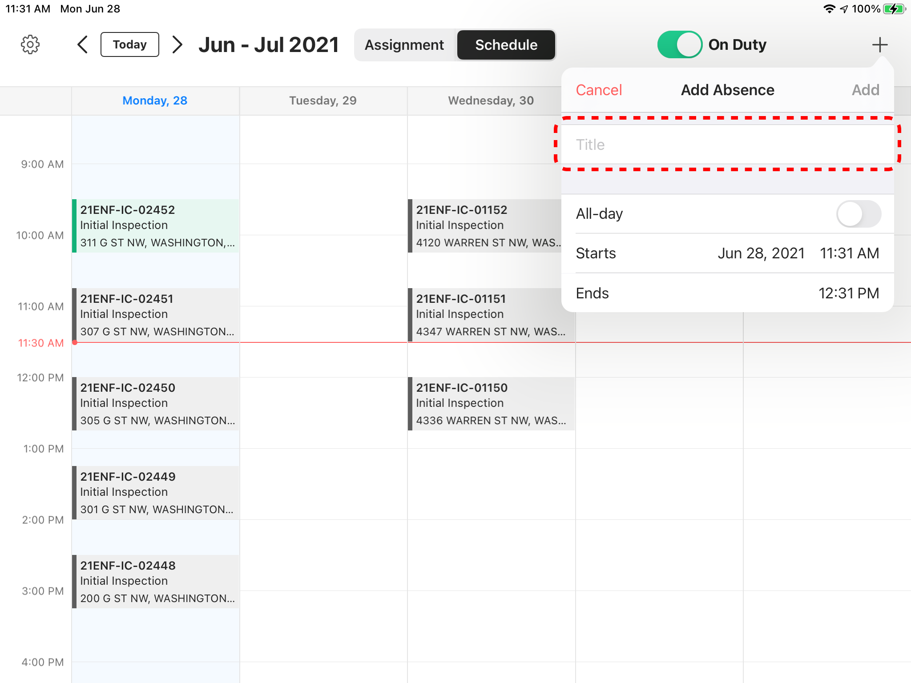{: data-lightbox="adding-absence2.png"}

On the "Calendar" click on the desired date for the absence 

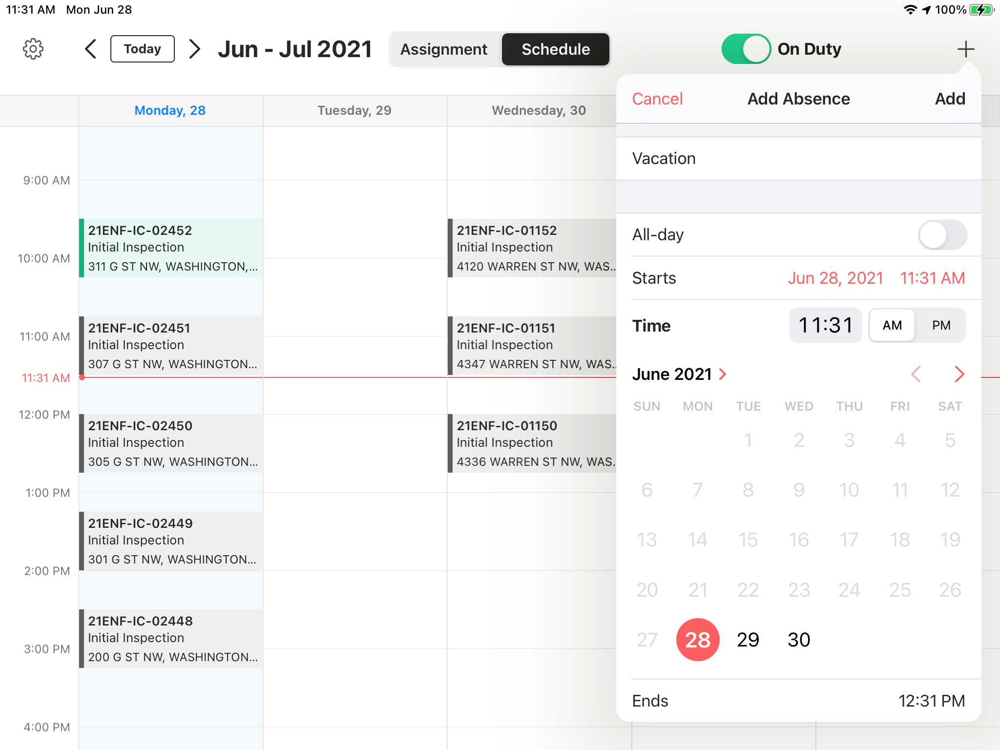{: data-lightbox="adding-absence3.png"}

Then click on "Time" and enter the starting time of the absence

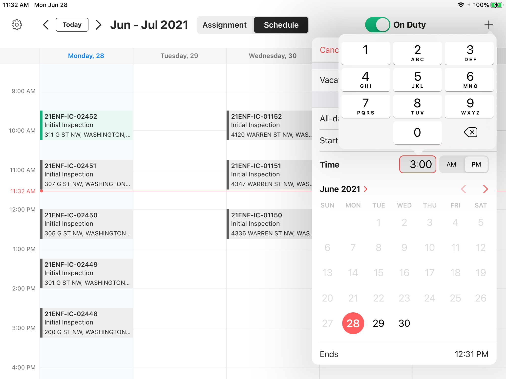{: data-lightbox="adding-absence4.png"}

Then click on "Ends" and enter the ending time of the absence

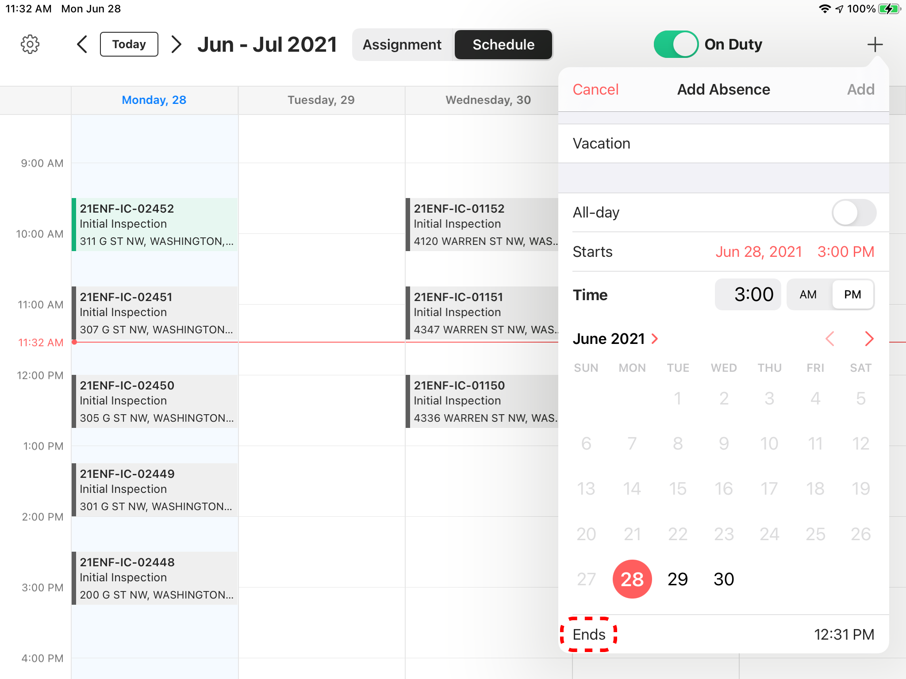{: data-lightbox="adding-absence5-group.png"}

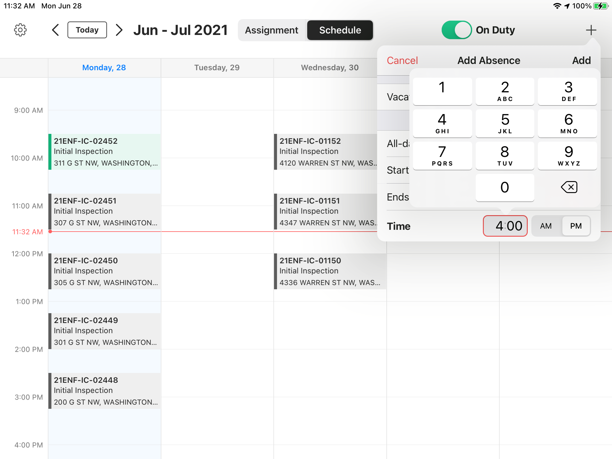{: data-lightbox="adding-absence5-group.png"}

Then click Add and system will create the absence and add it to the schedule. Any previously assigned Assignments for this time-frame will be removed from the Inspector's schedule and re-assigned and rescheduled by the system.

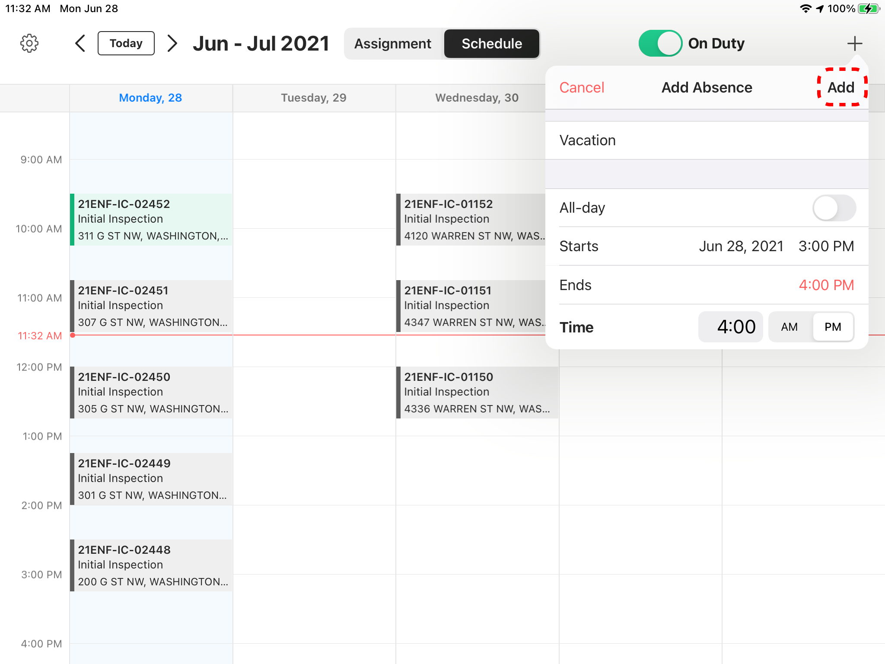{: data-lightbox="adding-absence7-group.png"}

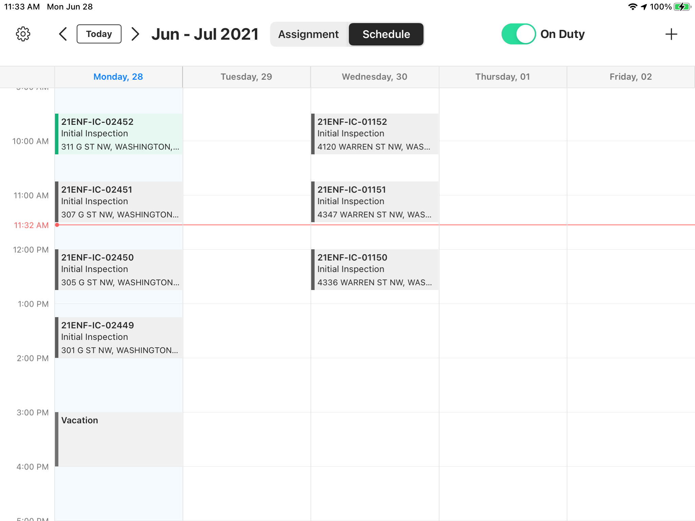{: data-lightbox="adding-absence7-group.png"}

<section id="adding-all-day-absences" markdown="1">

### Adding All Day Absences
If the user wants to report an All Day absence, they can click on the [+] icon and enter the reason for their absence in the "Title" field. Then they can toggle the All Day switch on, select the date, and click on Add button. The Absence will be displayed in the Schedule as All Day.

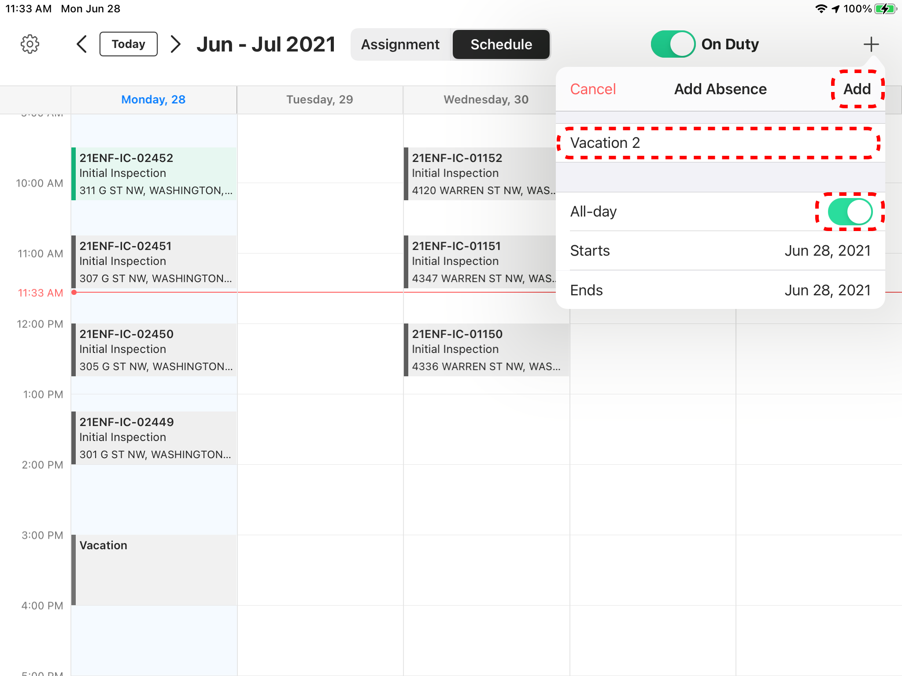{: data-lightbox="adding-all-day-absences1-group.png"}

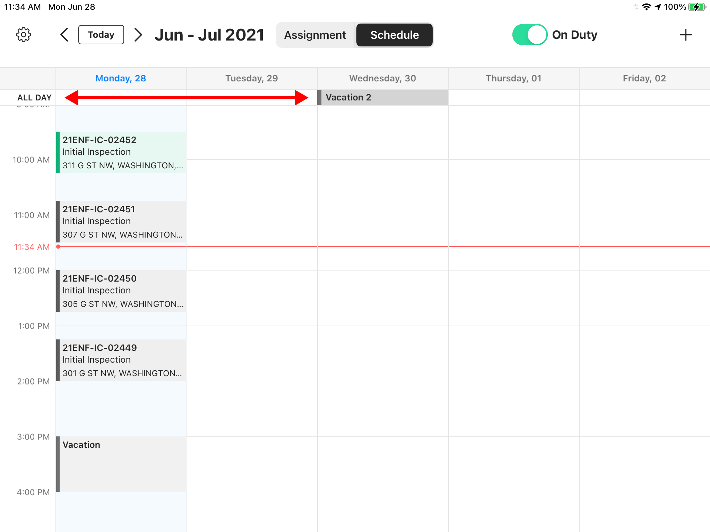{: data-lightbox="adding-all-day-absences1-group.png"}
</section>
</section>

<section id="deleting-an-absence" markdown="1">

## Deleting an Absence

Go to the Schedule and click on the "Absence" that is visible on the Schedule. Then click on the "Delete Absence" button. The system will delete the absence from the Inspector's Schedule and the Inspector will have that slot available for new Assignments.

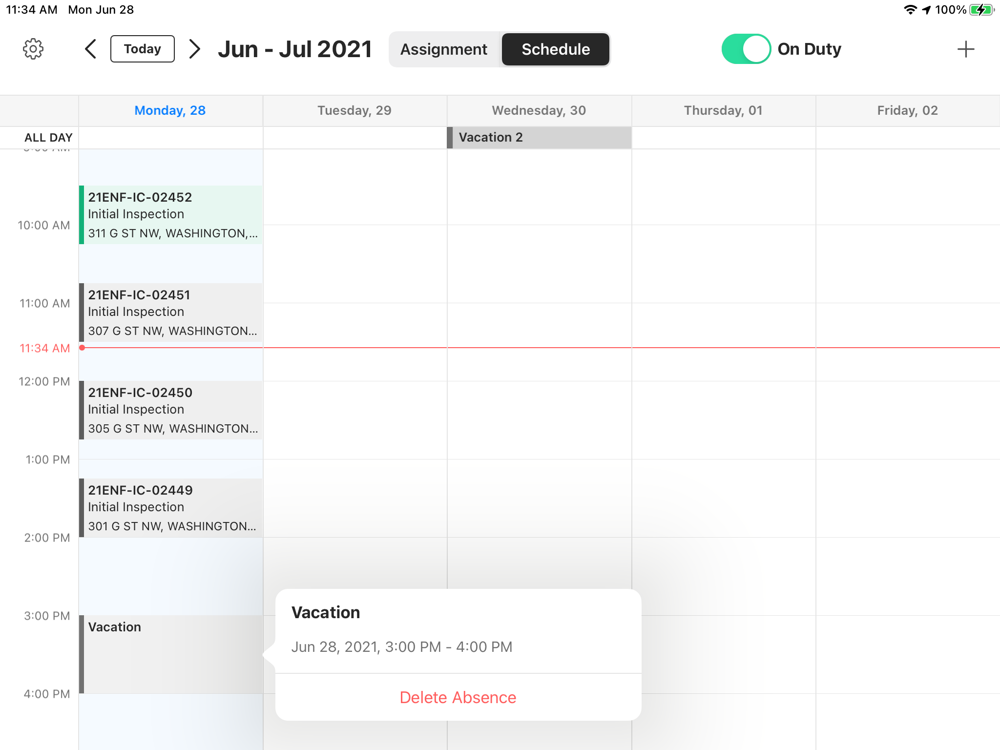{: data-lightbox="deleting-an-absence1-group.png"}

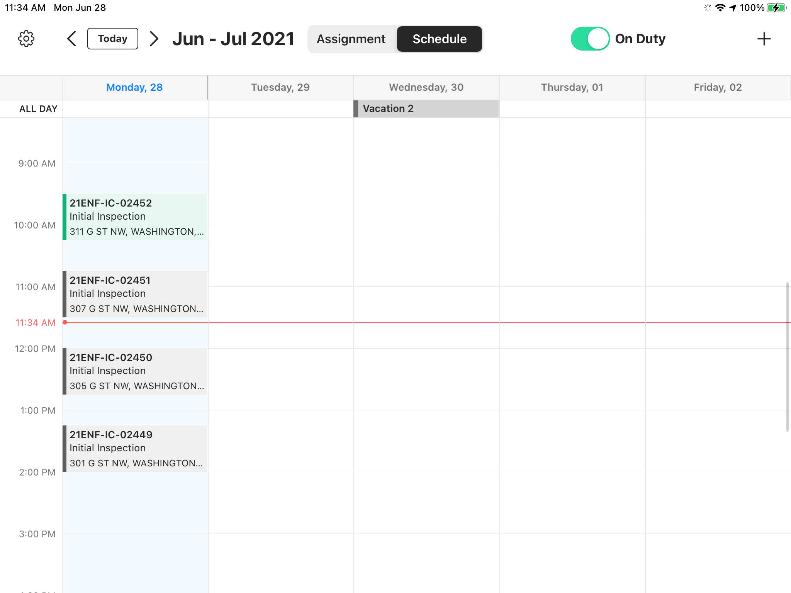{: data-lightbox="deleting-an-absence1-group.png"}

</section>
<section id="holidays" markdown="1">

## Holidays
Recognized holidays will restrict assignments from being assigned to inspectors, and cannot be removed from the schedule. 

</section>
</section>
