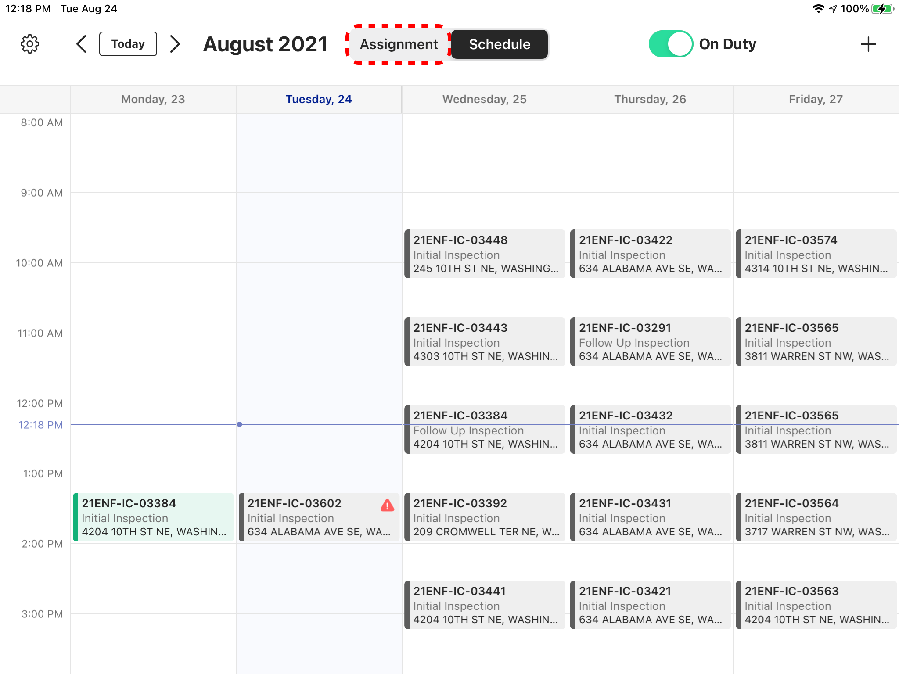
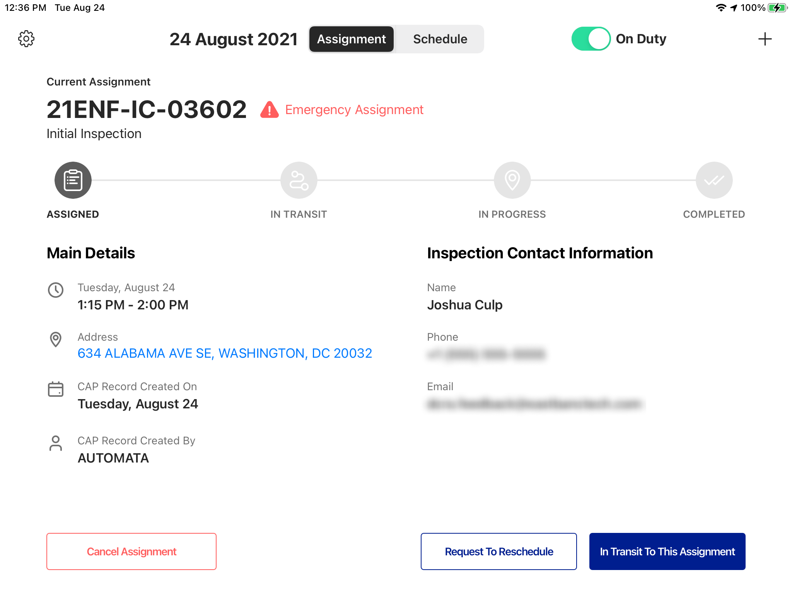
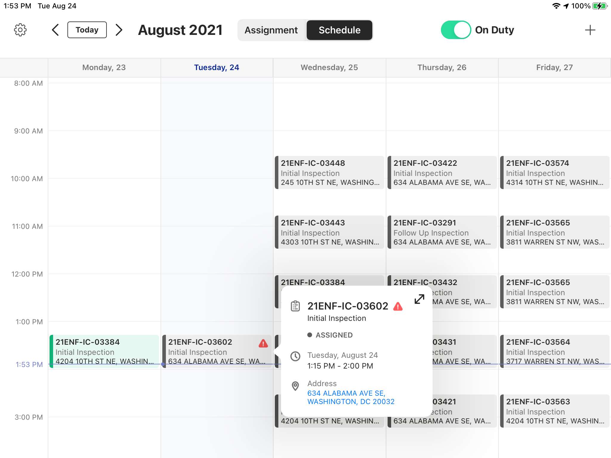
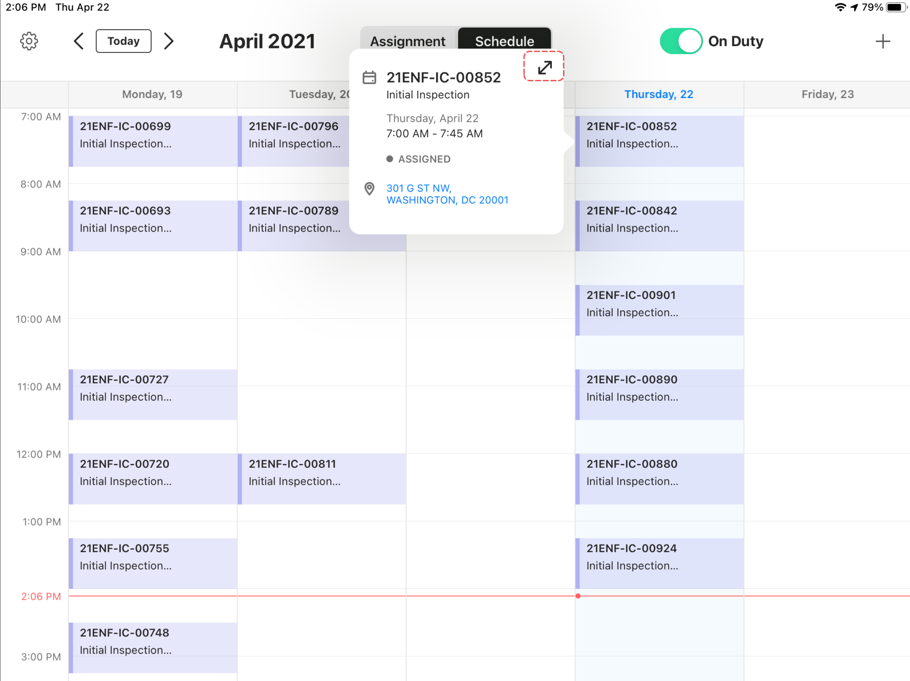
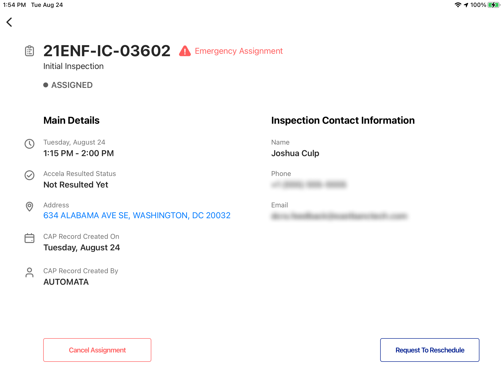
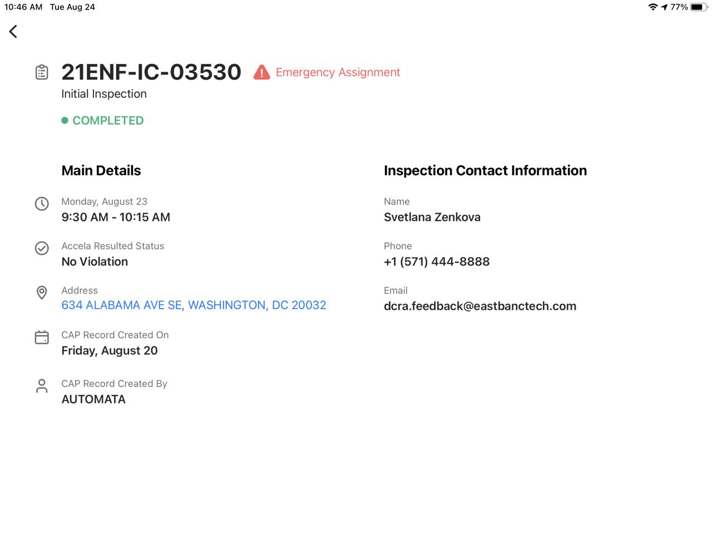

<section id="view-details-of-assignments" markdown="1">

# View Details of Assignments

Users can view details of an assignment through the Dispatch App.

<section id="view-current-assignment" markdown="1">

## View Current Assignment

Click on Assignment tab above the Schedule

This page is the Current Assignment page that the Inspector can work on

</section>

<section id="view-all-assignments" markdown="1">

## View all Assignments

Click on an Assignment from the Schedule

Then click on the Enlarge icon

This page is the Detailed Assignment page and although it provides all the details, the Inspector cannot work on it because it's not the Current Assignment. The Inspector, however, can Request to Reschedule or Cancel the Assignment from this page

Once an assignment is completed, the system will add additional details regarding the status from Accela. 

</section>
</section>

