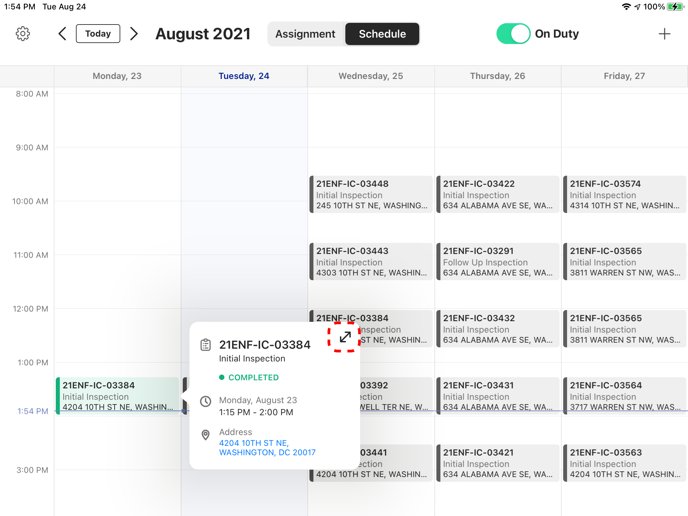
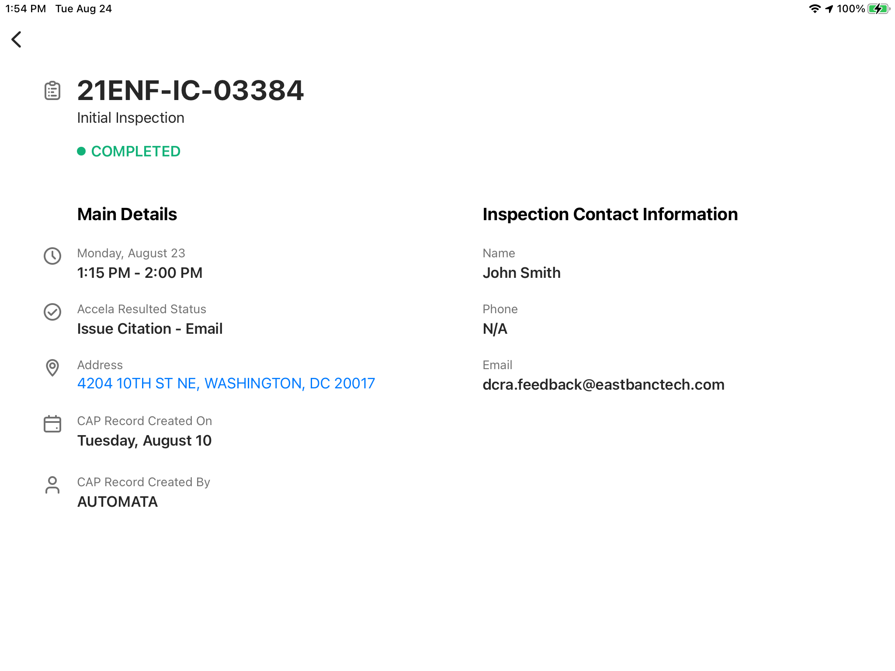

<section id="view-details-of-assignments" markdown="1">

# View Details of Assignments

Users can view details of an assignment through the Dispatch App.

<section id="view-current-assignment" markdown="1">

## View Current Assignment

Click on Assignment tab above the Schedule

{: data-lightbox="1"}

This page is the Current Assignment page that the Inspector can work on

{: data-lightbox="2"}
</section>

<section id="view-all-assignments-updated" markdown="1">

## View all Assignments UPDATED

Click on an Assignment from the Schedule

{: data-lightbox="3"}

Then click on the Enlarge icon

{: data-lightbox="4"}

This page is the Detailed Assignment page and although it provides all the details, the Inspector cannot work on it because it's not the Current Assignment. The Inspector, however, can Request to Reschedule or Cancel the Assignment from this page

{: data-lightbox="5"}

Once an assignment is completed, the system will add additional details regarding the status from Accela. 

{: data-lightbox="6-group"}

{: data-lightbox="6-group"}
</section>
</section>
