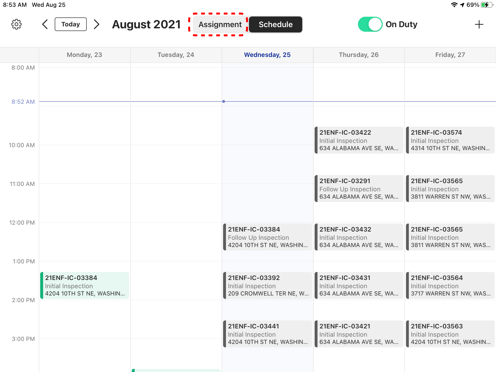
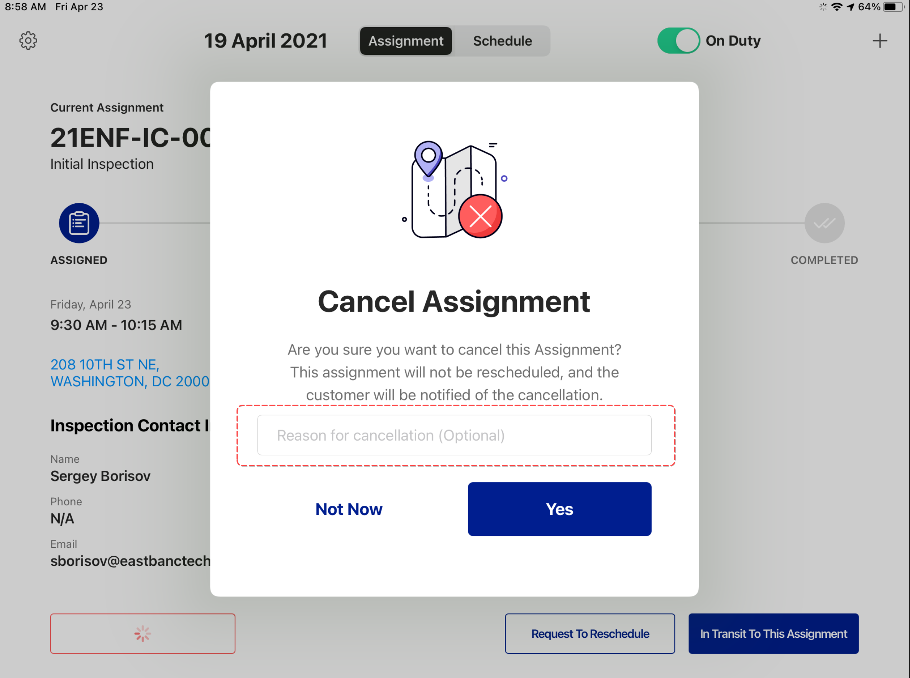
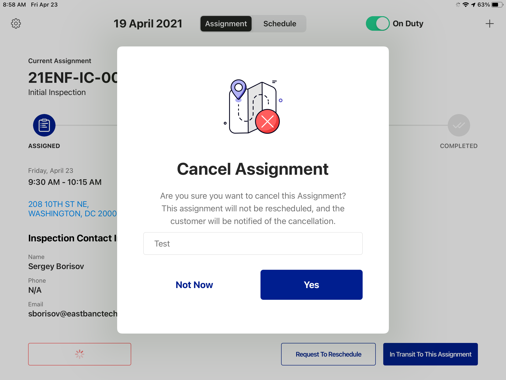
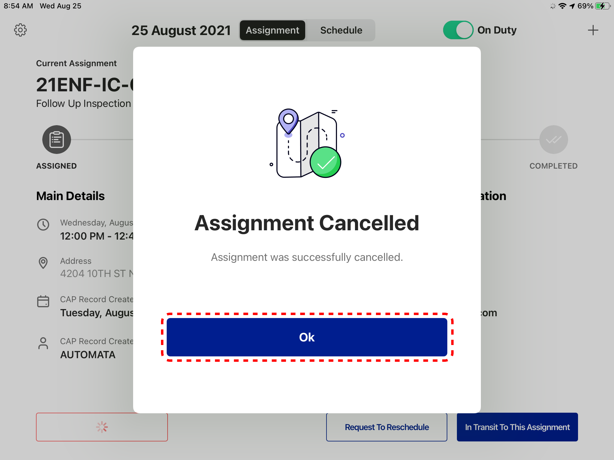
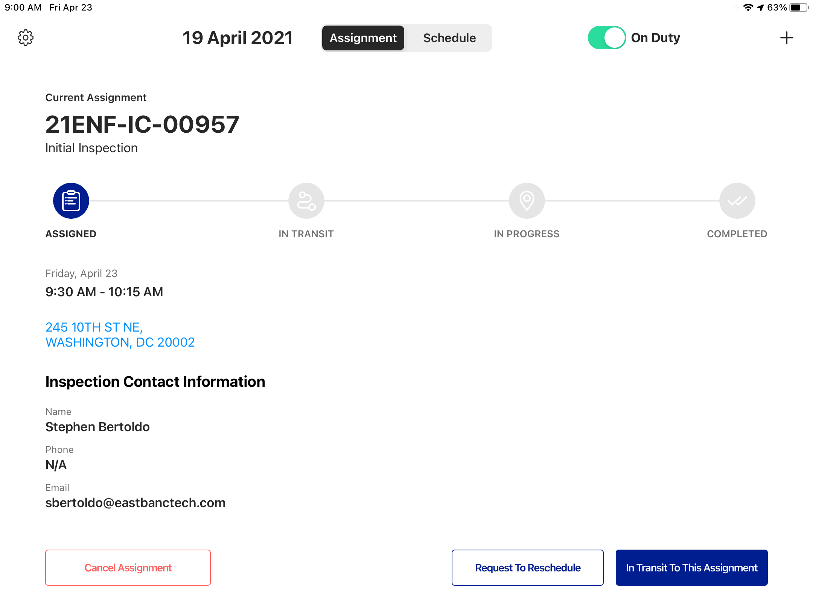
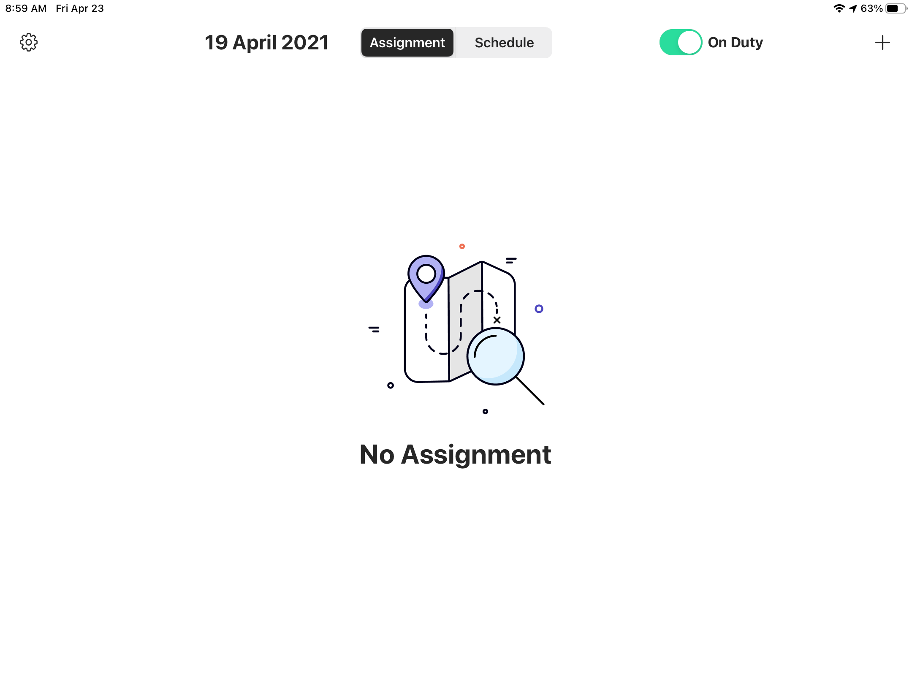
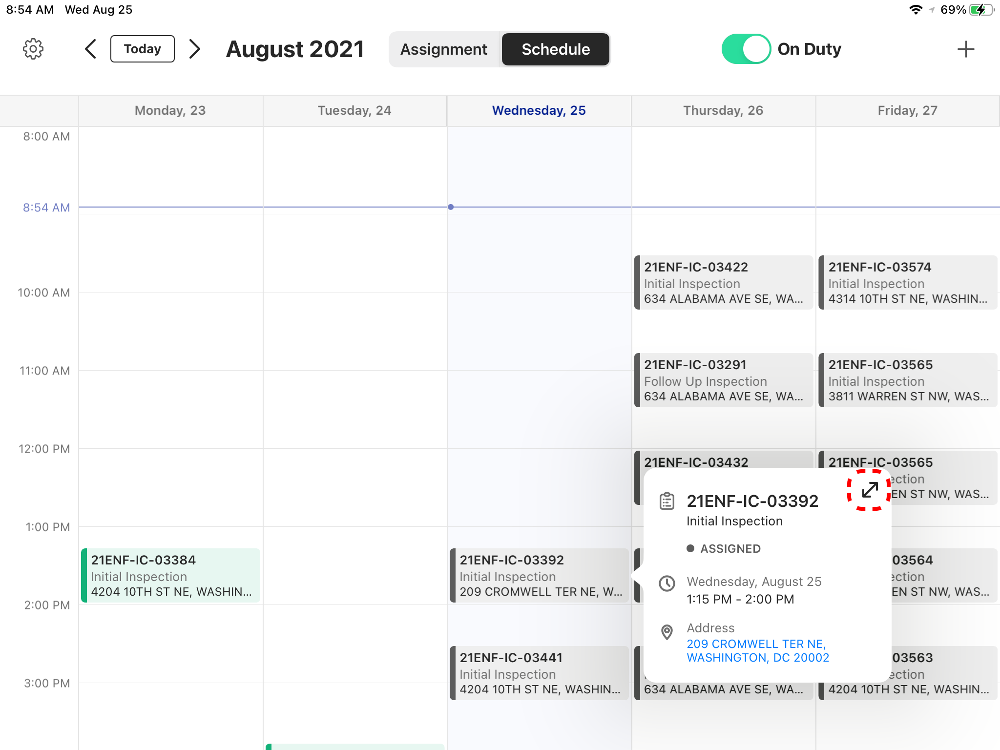
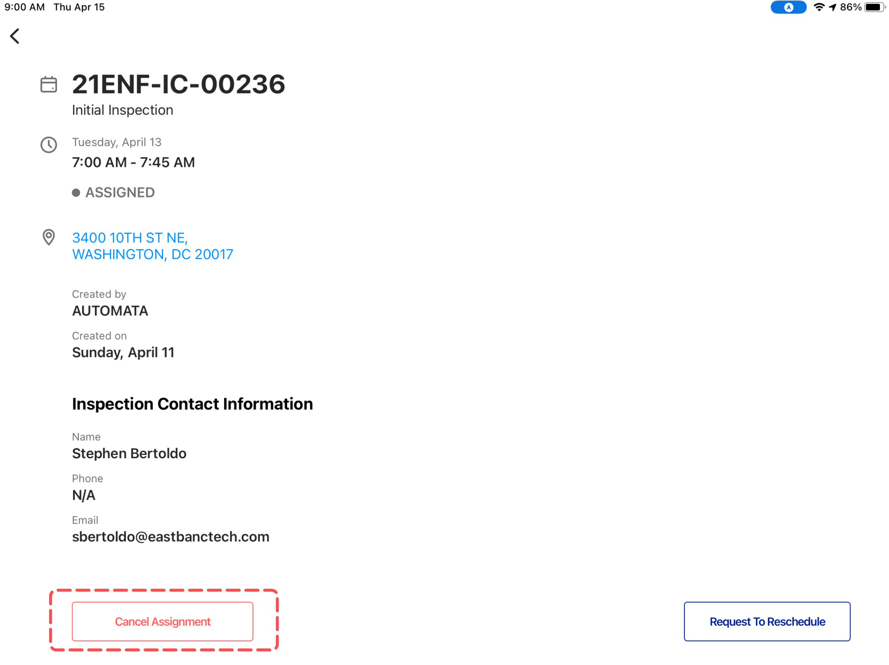
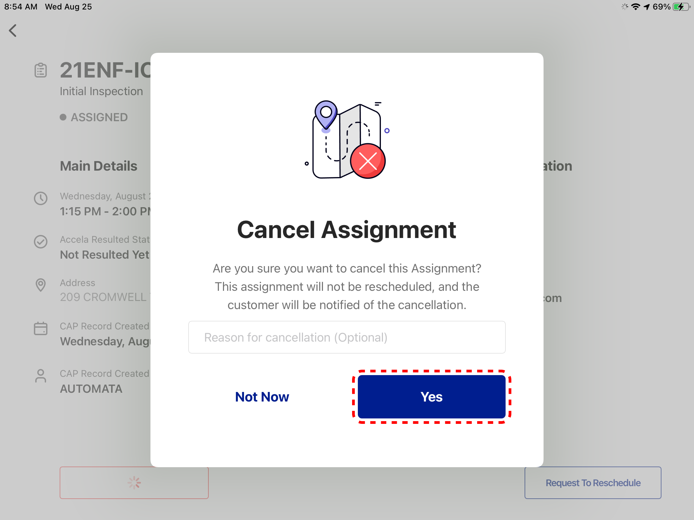
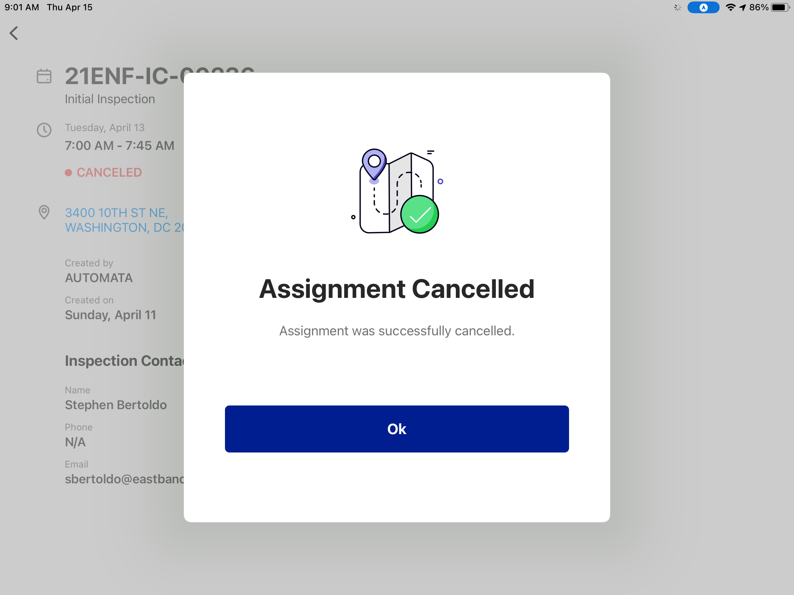

<section id="canceling-assignments" markdown="1">

# Canceling Assignments

Users have the ability to cancel assignments through the Dispatch App.

<section id="canceling-current-assignment" markdown="1">

## Canceling Current Assignment

Click on Assignment tab above the Schedule

Then click on the Cancel Assignment button

Enter the reason for cancellation (optional)

Then click the Yes button

Click on the OK button to dismiss the popup message

The App will display the next Assignment (if any)

If there's no Assignment on the Schedule the App displays the following

</section>

<section id="canceling-other-assignments" markdown="1">

## Canceling Other Assignments
Select an Assignment from the schedule, then click on it. Then click on the Enlarge Icon.

From the Detailed Assignment page, click the Cancel button.

Enter a reason for cancellation (optional) and click on the Yes button

Click Ok to dismiss the popup message

The App will display the next Assignment (if any), and if there's no assignment it will display a "No Assignment" message

</section>
</section>

