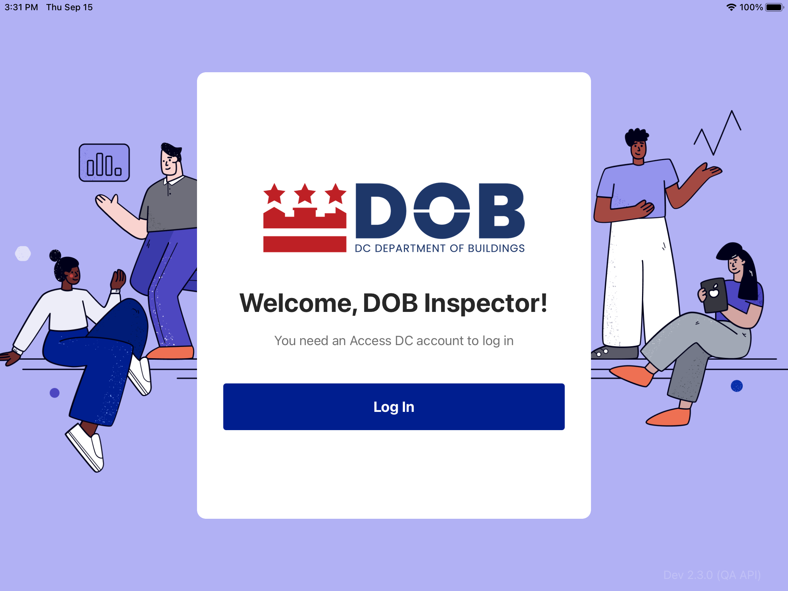

<section id="how-to-install-the-dispatch-app" markdown="1">

# How to Install the Dispatch App

1. On DOB iPad device, go to “DC APPS”

    {: data-lightbox="1"}

2. Find “DOB Dispatch” and click Install
    
    {: data-lightbox="2"}

3. After install, login to the app using an existing Access DC account. If there is an issue logging in, contact your manager or technical support.

    {: 
   data-lightbox="3"}

</section>
