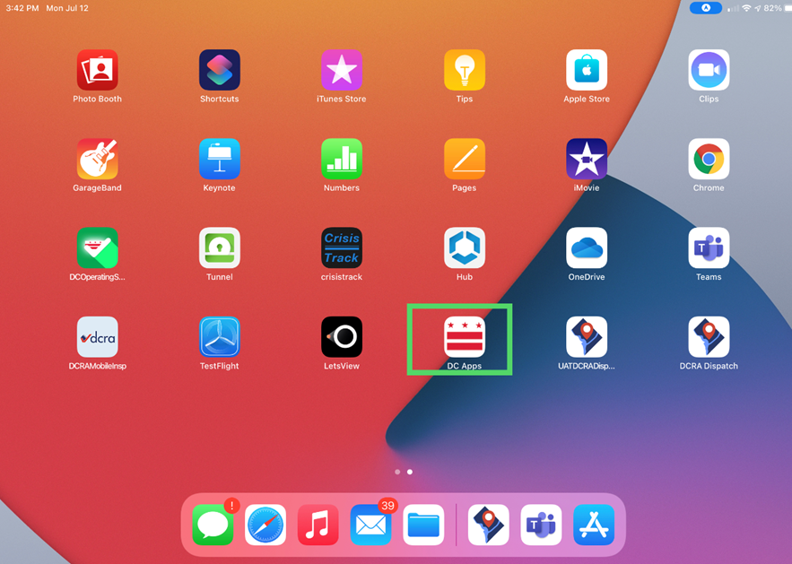
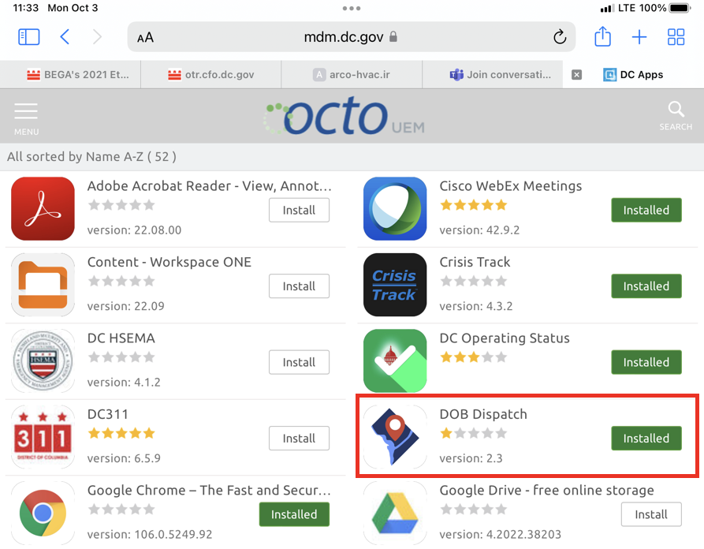
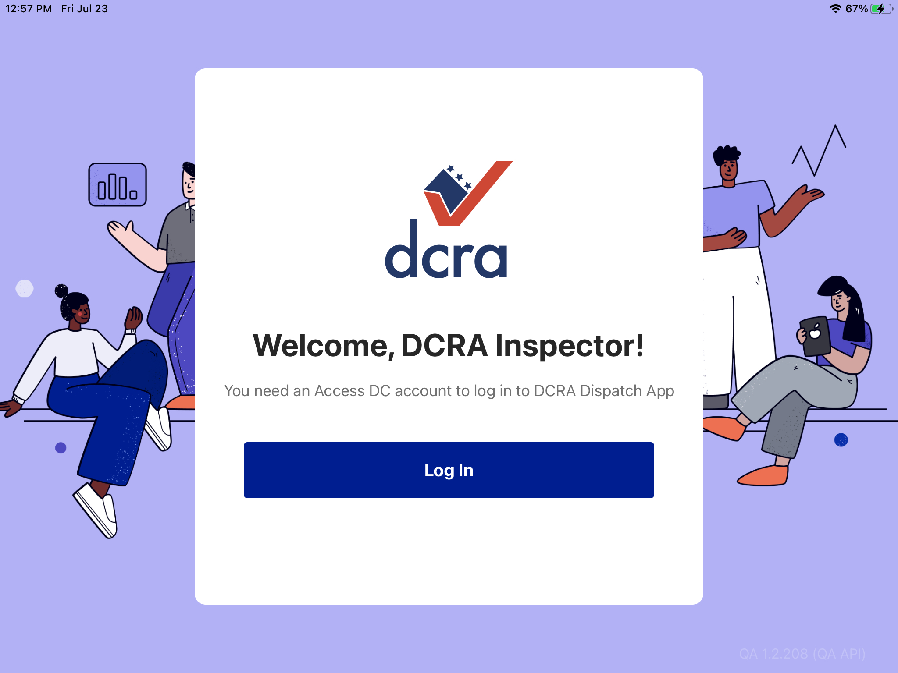

<section id="how-to-install-the-dispatch-app" markdown="1">

# How to Install the Dispatch App

Step-1 --- On your DCRA iPad device, go to “DC APPS”

Step-2 ---Find “DCRA Dispatch” and click Install

Step-3 ---After install, login to the app using your Access DC account. If you receive an error message, reach out to your manager to ensure you're correctly provisioned. 

</section>
