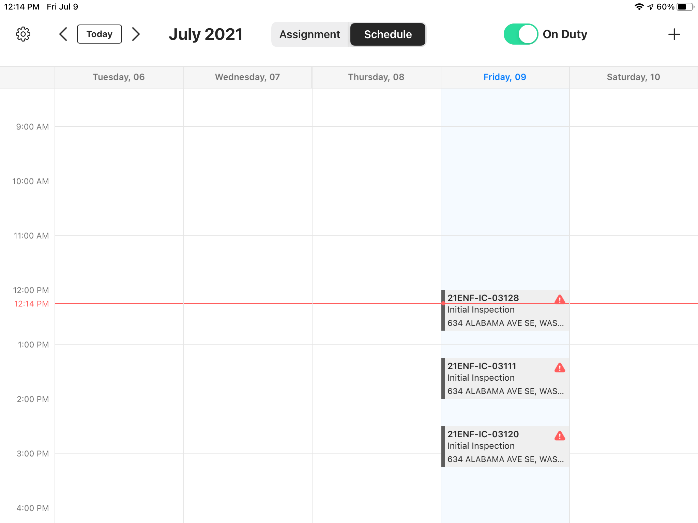
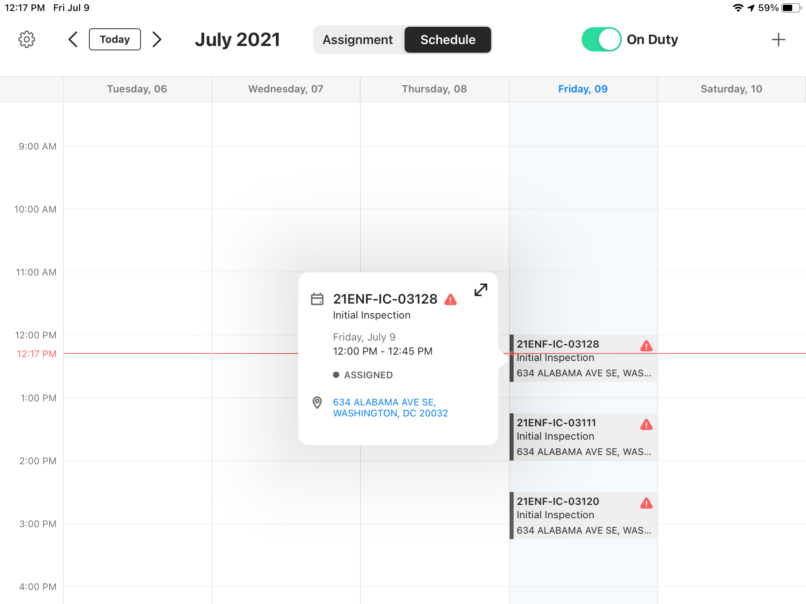
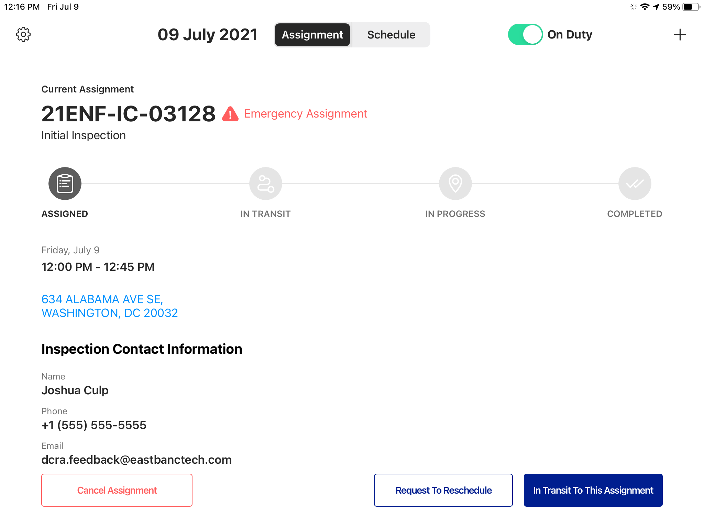
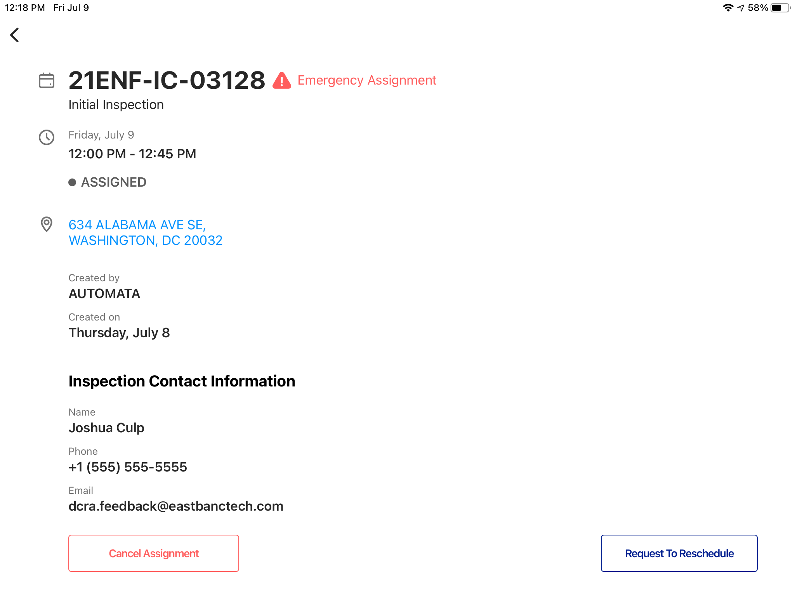

<section id="emergency-assignments" markdown="1">

# Emergency Assignments
When an emergency assignment is assigned to you it will have a red [!] indication on your schedule.

Selecting an inspection via your schedule will trigger a popover containing additional details about the assignment. The popover will also have the red [!] indication.

Both the current assigment screen and the assignment details screens will also display the red [!] indicator as well as text reading "Emergency Assignment."

</section>
