<section id="dispatch-app-login-and-logout" markdown="1">

# Dispatch App Login and Logout

<section id="dispatch-app-login" markdown="1">

## Dispatch App Login
To use the Dispatch app, the user must login with a valid Access DC Username and Password.

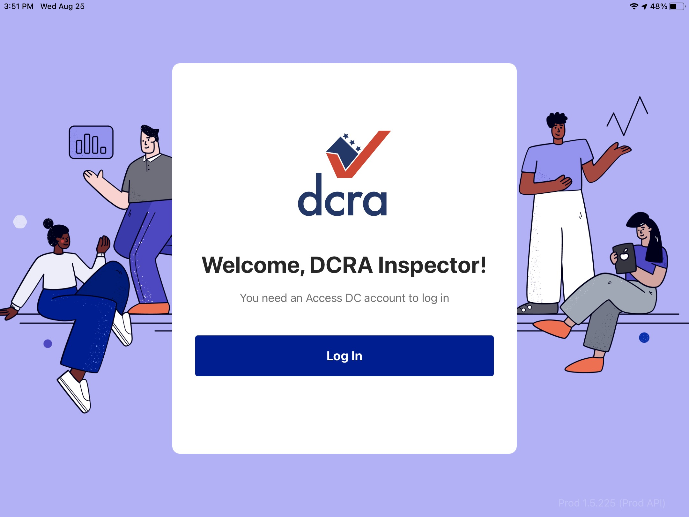

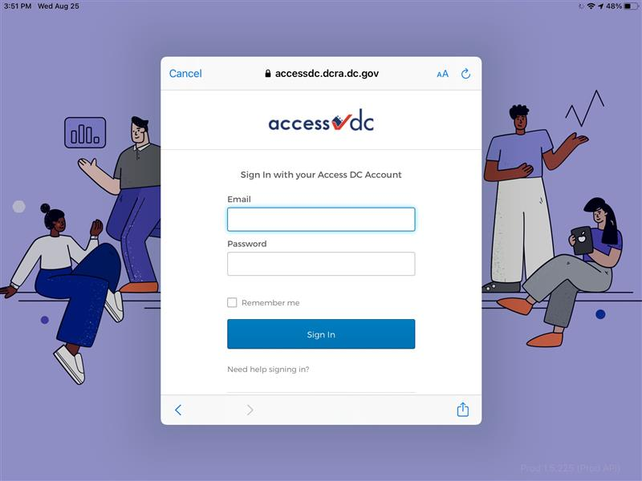

<section id="first-login" markdown="1">

### First Login
If this is the first login to the App, follow the steps below:

Click on Allow button.

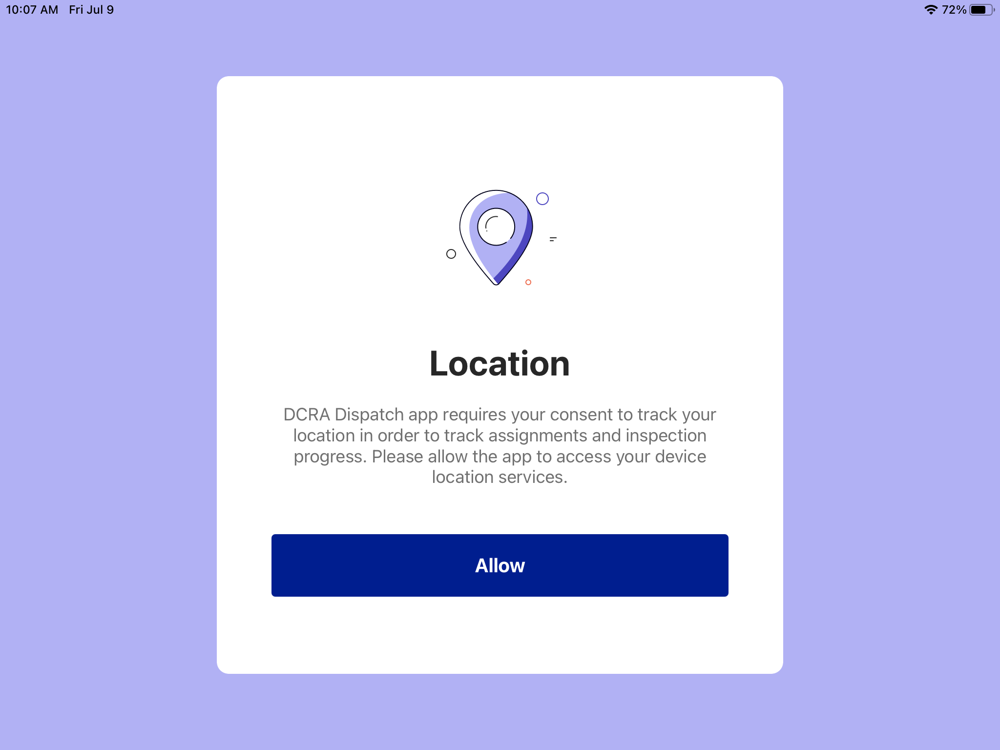

Then click on Go To Settings button.

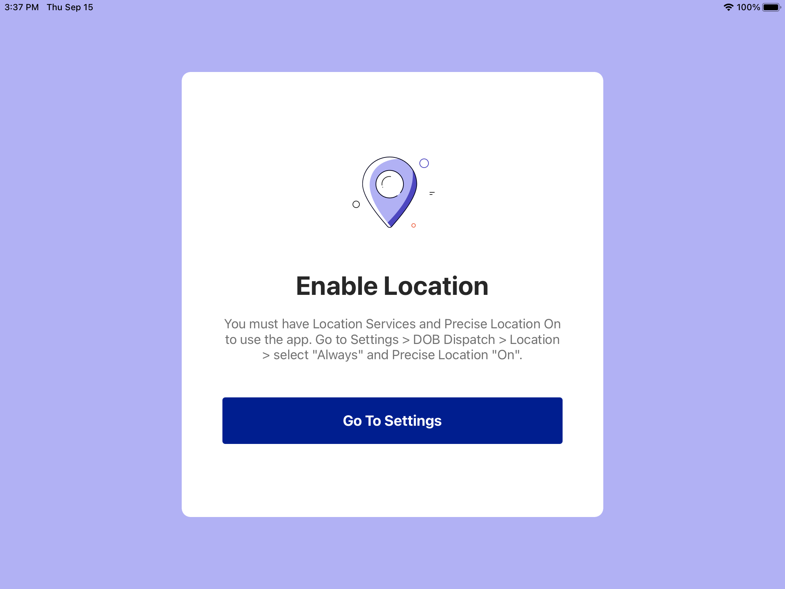

Find the DCRA Dispatch application in the Settings menu bar; select the Location option.

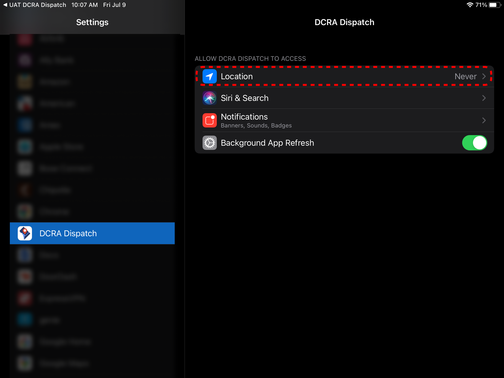

Change the ALLOW LOCATIONS ACCESS setting to Always; a new option will become available labeled Precise Location, toggle this to on.

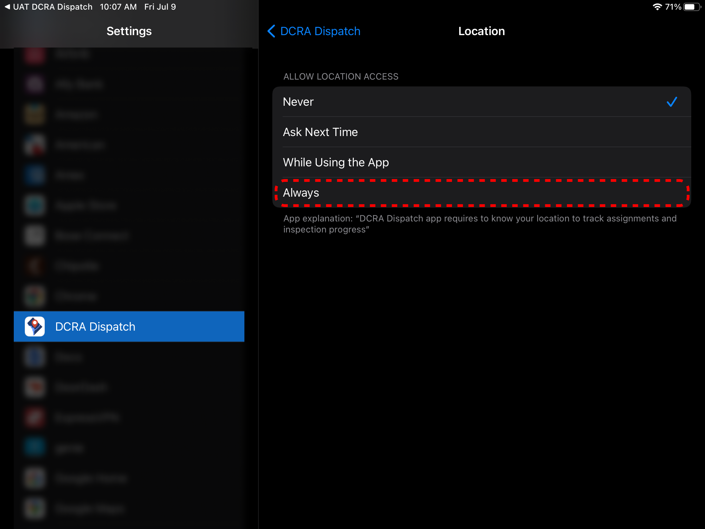
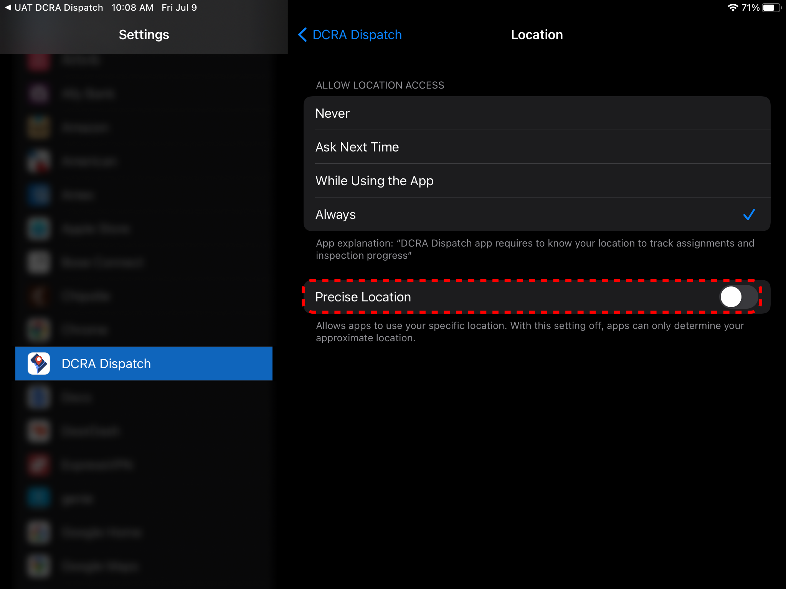
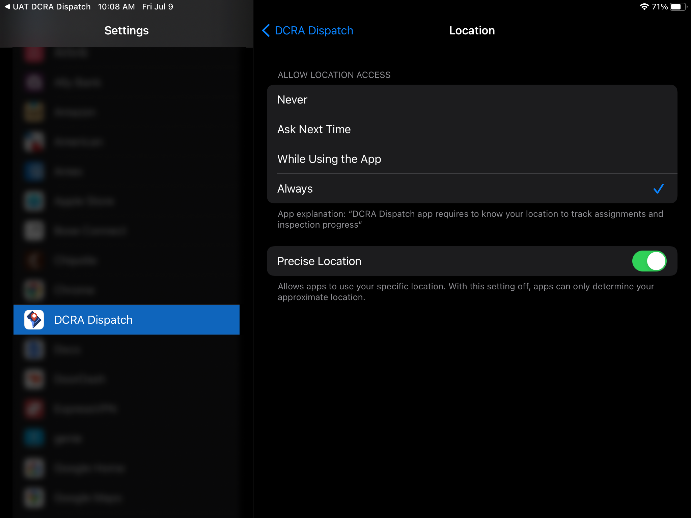

Return to the application upon completing the above steps.

Once logged in, Inspectors will receive several popups requesting permissions and indicator to begin work so that their location can be reported to DCRA.

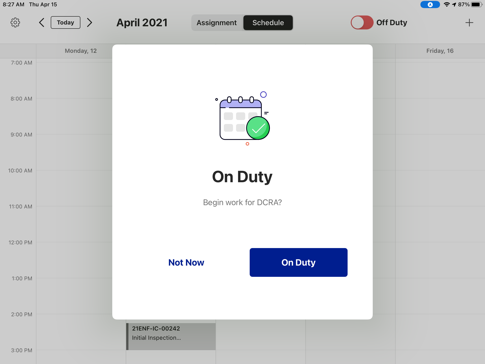

Once clicking On Duty button, Inspectors see their Schedule for the week as seen below.

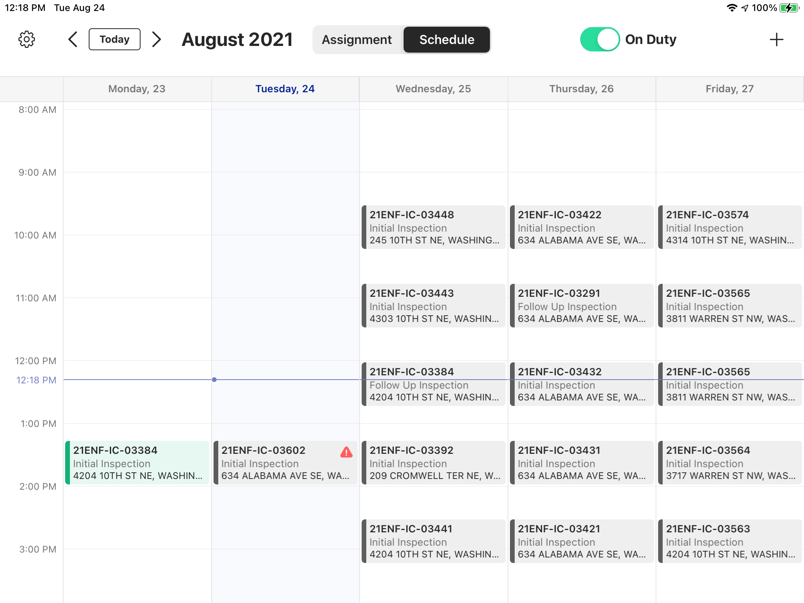

</section>

</section>

<section id="dispatch-app-logout" markdown="1">

## Dispatch App Logout

To logout click on the Settings icon.

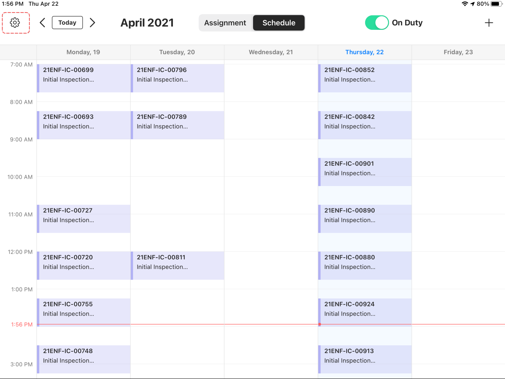

Then click on the Logout button.

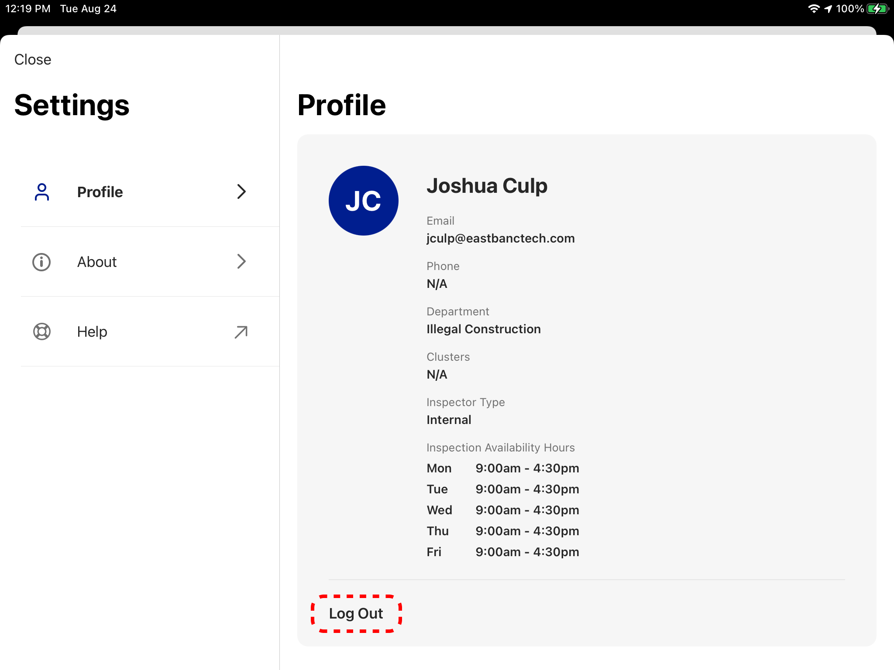

After logging out, the App displays the login page.

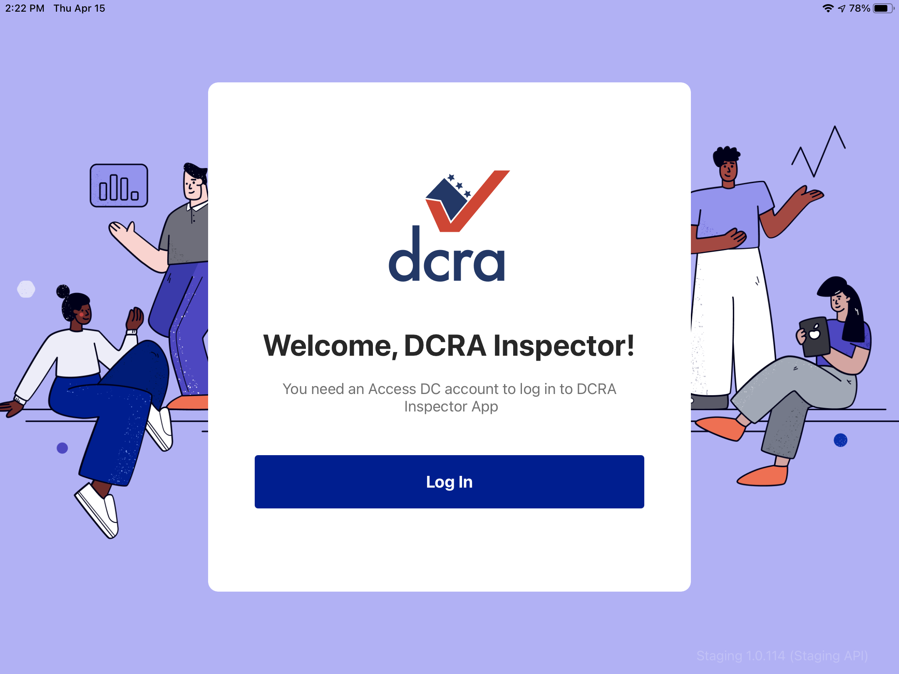
</section>
</section>