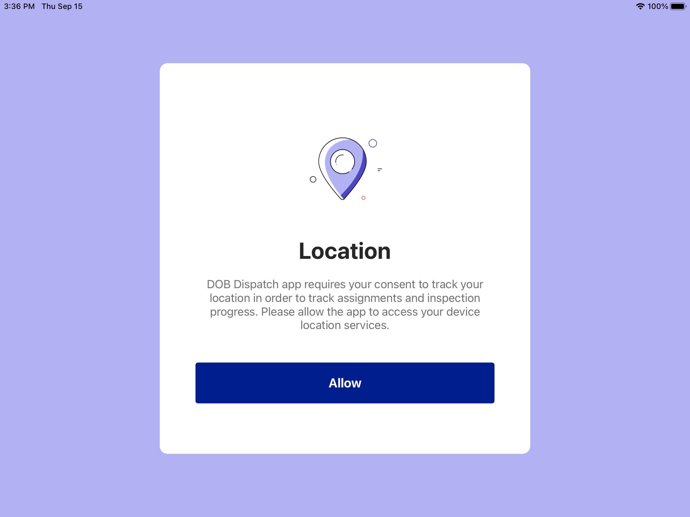
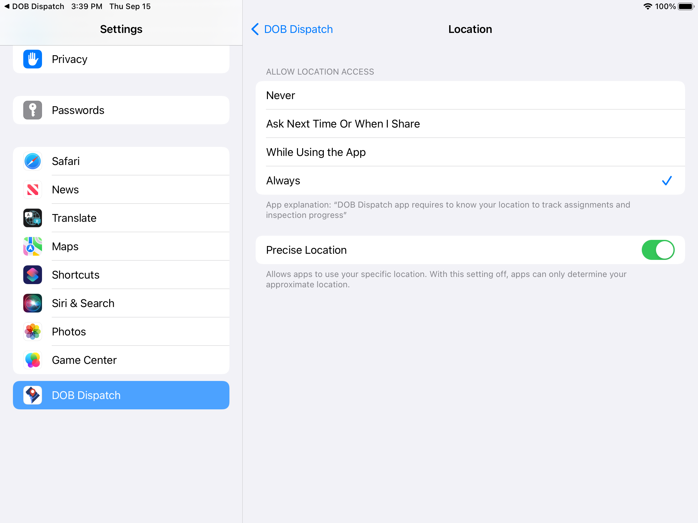

<section id="dispatch-app-login-and-logout" markdown="1">

# Dispatch App Login and Logout

<section id="dispatch-app-login" markdown="1">

## Dispatch App Login
To use the Dispatch app, the user must login with a valid Access DC Username and Password. 

To resolve any login issues with the Dispatch app, Inspectors should contact their manager or technical support. 

<section id="first-login" markdown="1">

### First Login
If this is the first login to the Dispatch app, after entering the Email and Password, follow the steps below:

1. Click Allow button to give permission to track the location of the device.

2. Click Go To Settings button.

3. Find the DCRA Dispatch app in the Settings menu bar; select the Location option.

4. Change the ALLOW LOCATIONS ACCESS setting to Always; a new option will become available labeled Precise Location, toggle this to on.

5. Return to the application upon completing the above steps.

6. Review [On and Off Duty functionality](https://dcra-dispatch-docs.terraiq.io/docs/da-on-off-duty.html)

</section>

</section>

<section id="dispatch-app-logout" markdown="1">

## Dispatch App Logout

To logout:

1. Click on the Settings icon.

2. Click on the Logout button.

After logging out, the App displays the login page.

</section>
</section>
