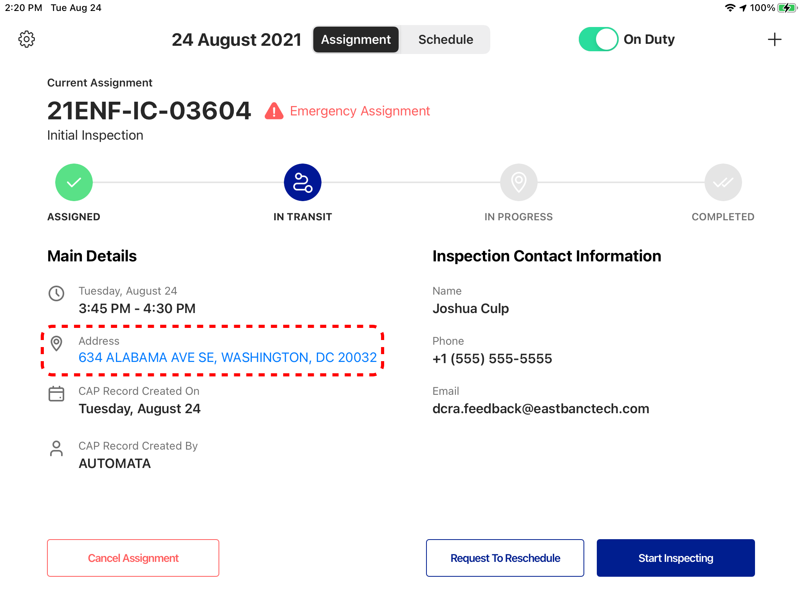
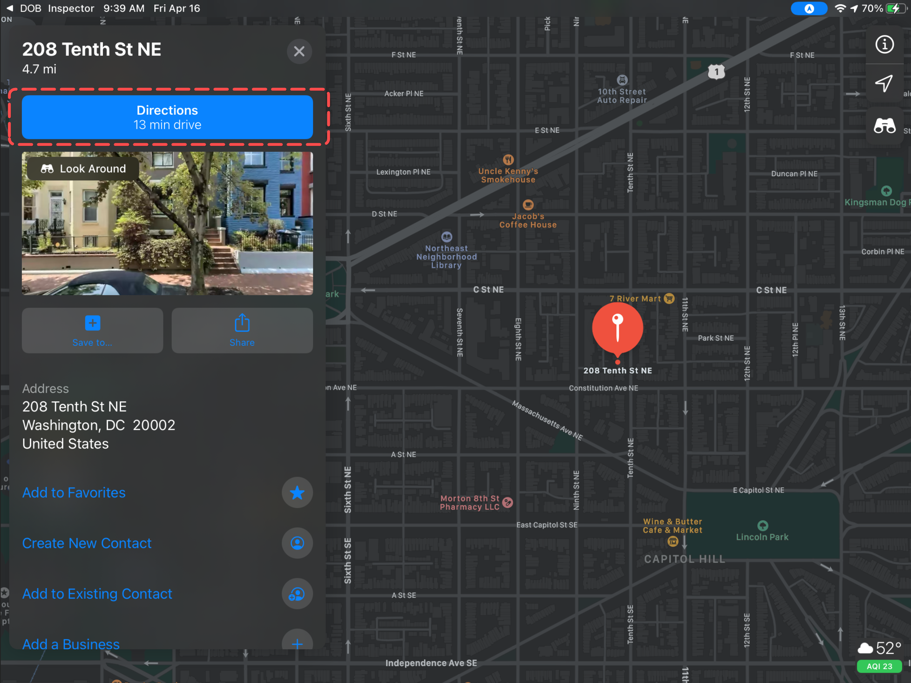

<section id="navigating-to-assignment-location" markdown="1">

# Navigating to Assignment Location

Go to the Current Assignment page and click on the "In Transit" button. This is an indicator to both the Customer and DOB that the Inspector is en route to the Assignment location

{: data-lightbox="1"}

Then click on Assignment Address

{: data-lightbox="2"}

The default navigation application will pop up with the Assignment location. Click on Directions to receive turn-by-turn navigation directions to the address

{: data-lightbox="3"}

</section>

