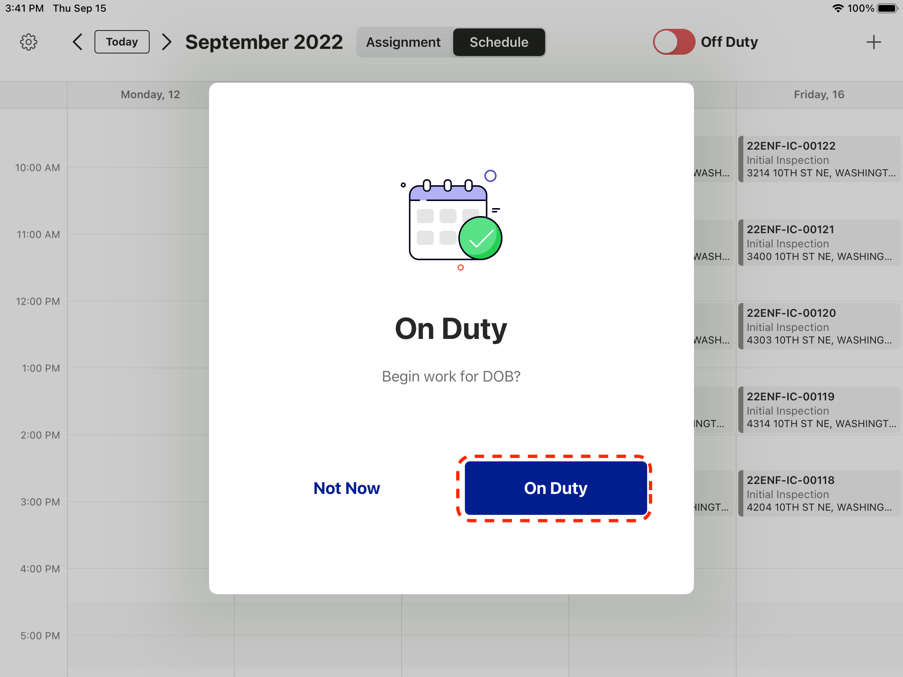
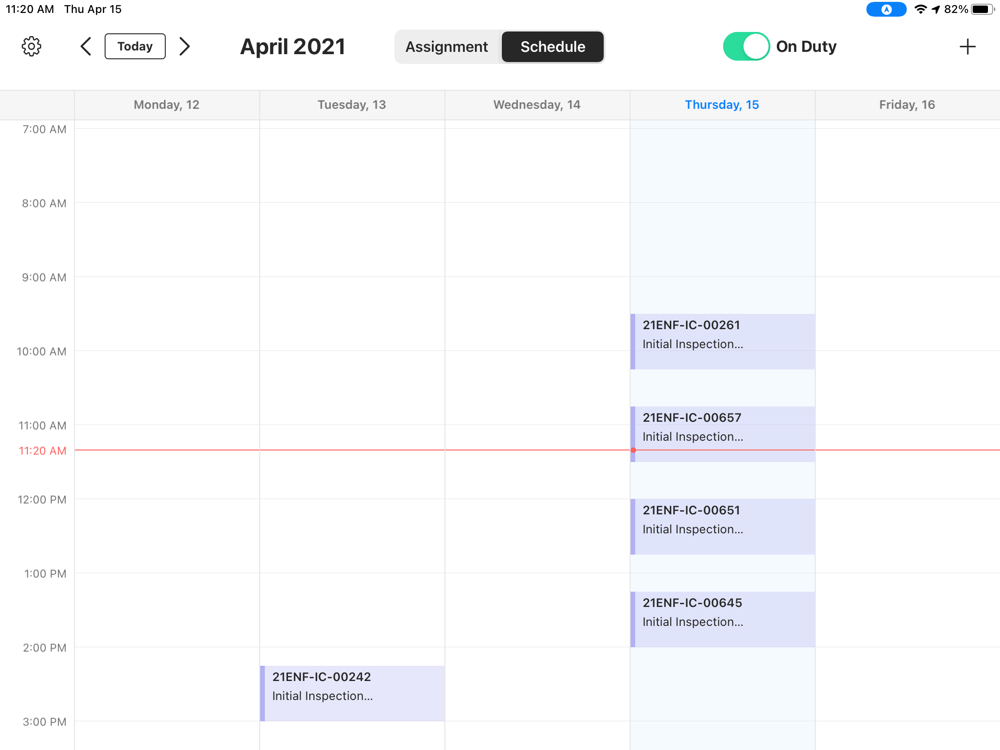
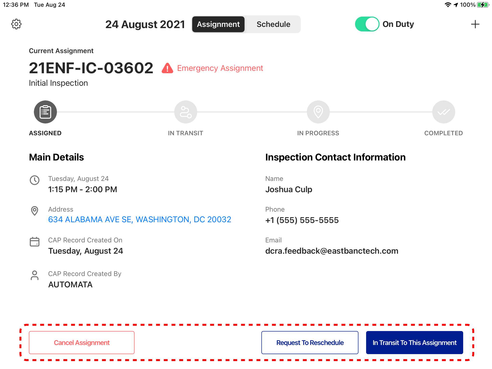
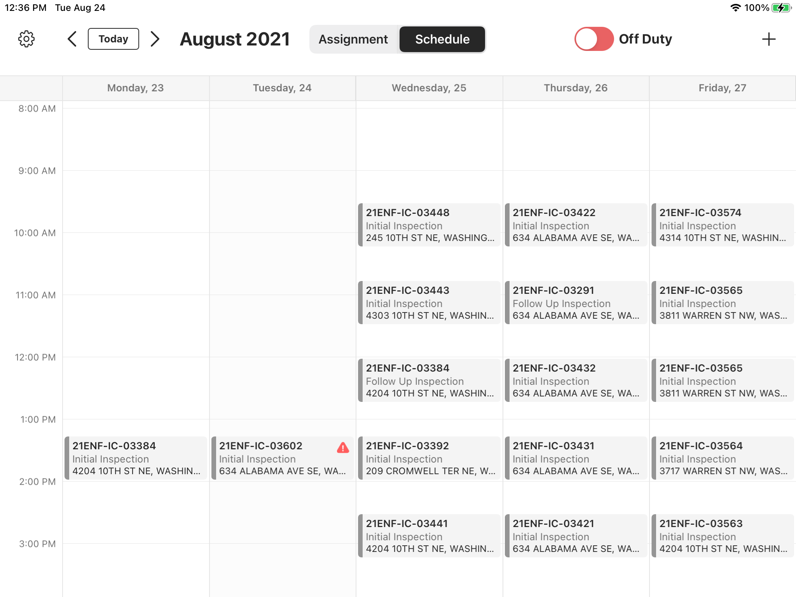
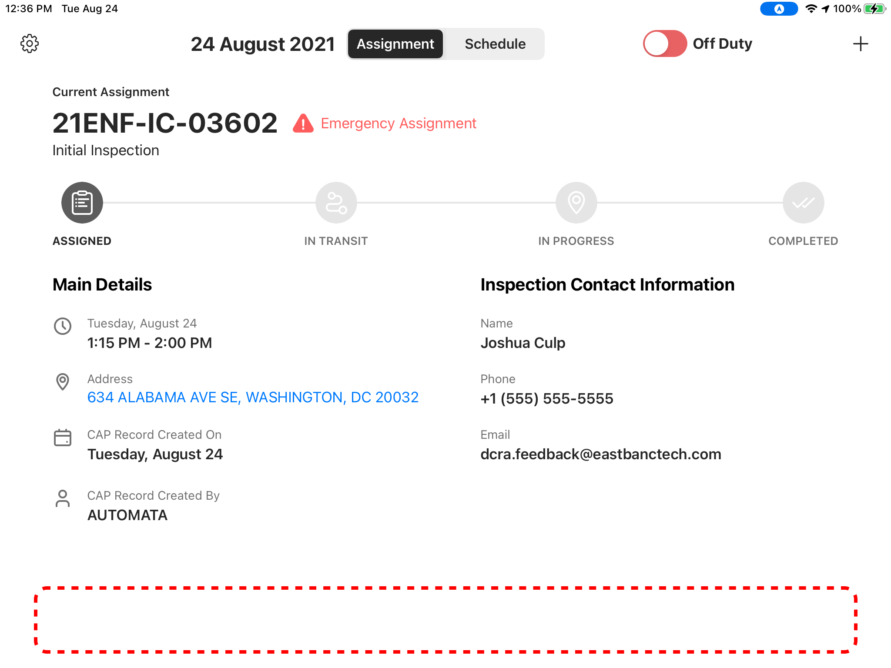
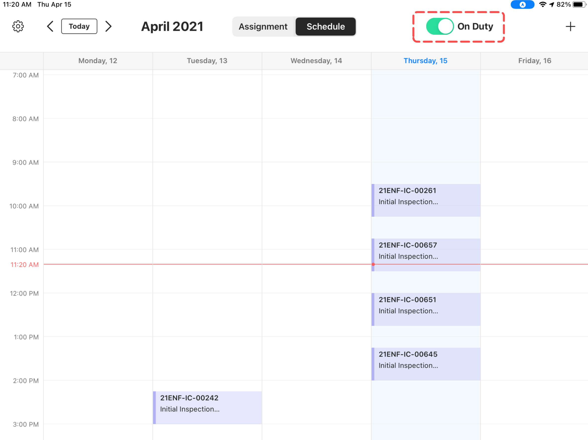

<section id="on-duty-and-off-duty" markdown="1">

# On Duty and Off Duty
Inspectors have the ability to use the Dispatch app while both on duty and off duty, with difference in mode, Active vs. Inactive. 

<section id="on-duty" markdown="1">

## On Duty
Once logged in, Inspectors see a popup, that allows them to indicate their on duty status so that their location can be reported to DOB. 

{: data-lightbox="1"}

<section id="schedule-in-active-mode" markdown="1">

### Schedule in Active Mode

By selecting On Duty button, the Schedule triggers Active mode, where Inspectors can interact with assignments and add Absences.

{: data-lightbox="2"}

</section>
<section id="current-assignment-page-in-active-mode" markdown="1">

### Current Assignment Page in Active Mode

The Current Assignment page is also in Active mode, and Inspectors can interact with it.

{: data-lightbox="3"}
</section>
</section>

<section id="off-duty" markdown="1">

## Off Duty

If Inspectors select the "Not Now" button, the Schedule and Current Assignment page remain Inactive and are greyed out. Inspectors are able to view their Schedule but cannot interact with it or Current Assignment page. 

<section id="schedule-in-inactive-mode" markdown="1">

### Schedule in Inactive Mode

{: data-lightbox="4"}

</section>
<section id="current-assignment-page-in-inactive-mode" markdown="1">

### Current Assignment page in Inactive Mode

{: data-lightbox="5"}

</section>
</section>

<section id="switching-between-off-duty-and-on-duty" markdown="1">

## Switching Between Off Duty and On Duty
As soon as Inspectors turn the toggle switch to On Duty, the Schedule and the Current Assignment page become Active and Inspectors can begin working on assignments.

{: data-lightbox="6"}

</section>
</section>
