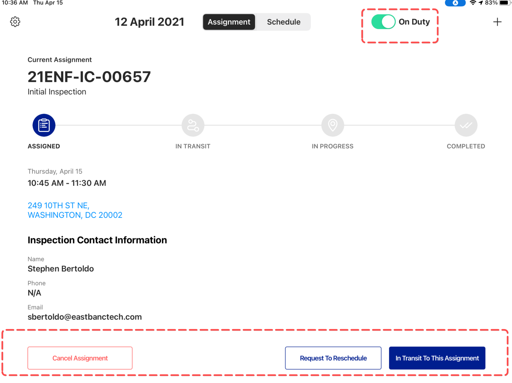

<section id="on-duty-and-off-duty" markdown="1">

# On Duty and Off Duty
Users have the ability to use the Dispatch app while both on duty and off duty. 

<section id="on-duty" markdown="1">

## On Duty
Once the Inspector logs in, a popup message appears on the screen.

By selecting On Duty button, the app displays an active Schedule and current Assignment page.

</section>

<section id="off-duty" markdown="1">

## Off Duty

However, if the Inspector selects the "Not Now" button, the App allows the Inspector to view the Schedule and Assignment page, but not to work on any assignments. Inspectors cannot work on assignments when they are Off Duty and therefore the Schedule and Assignment pages are greyed out and are inactive.
   

</section>

<section id="switching-between-off-duty-and-on-duty" markdown="1">

## Switching Between Off Duty and On Duty
As soon as the Inspector turns the toggle switch On Duty, the Schedule and the Assignment page become active and the Inspector can begin working on assignments

</section>
</section>

