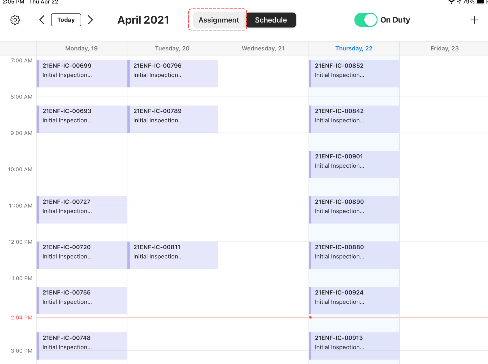
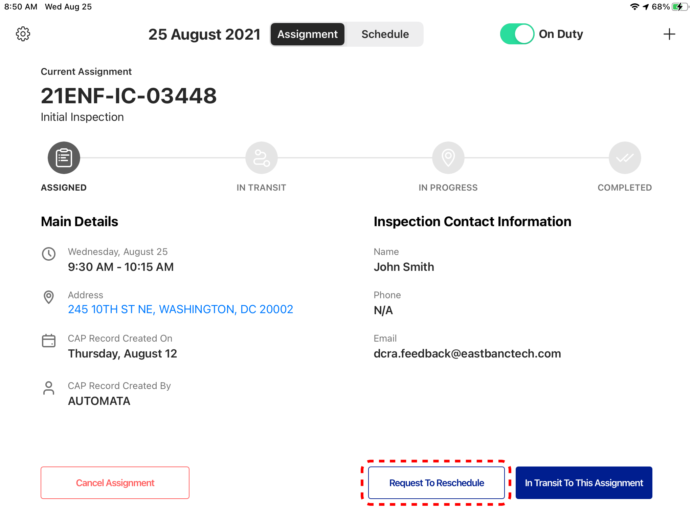
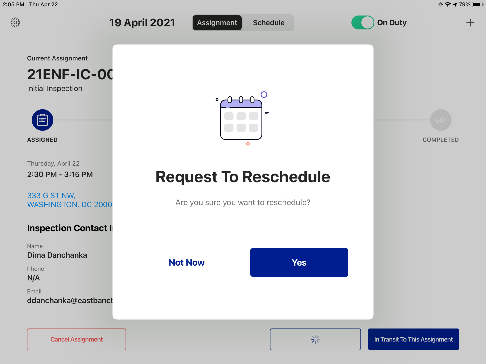
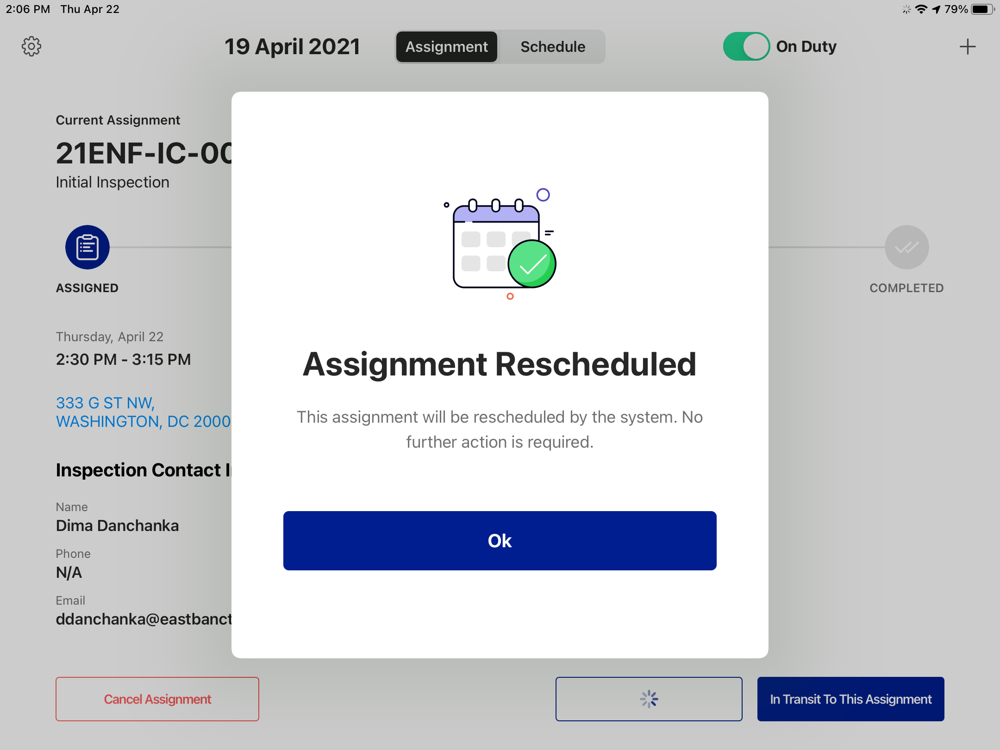
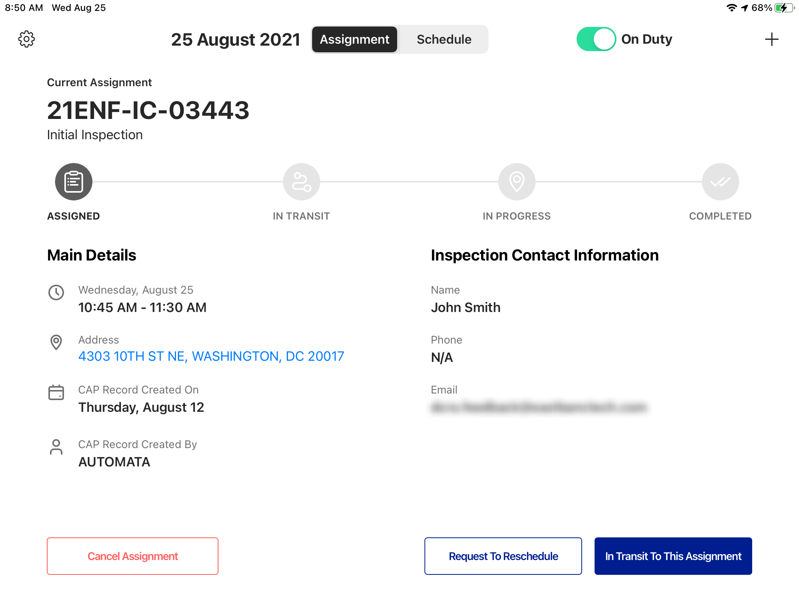
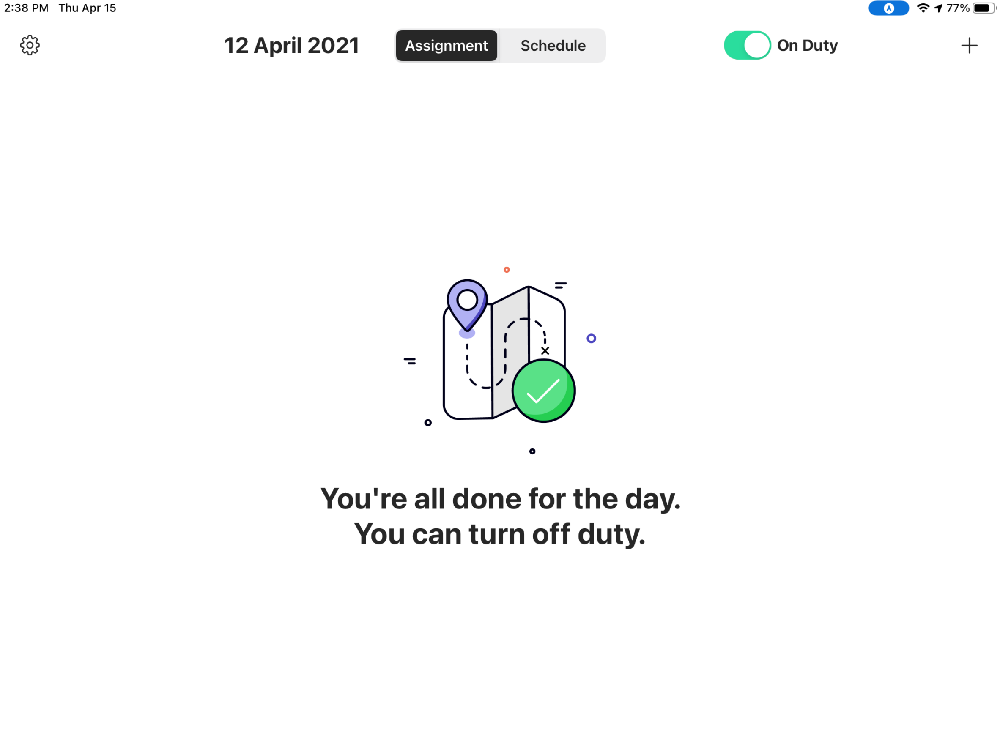
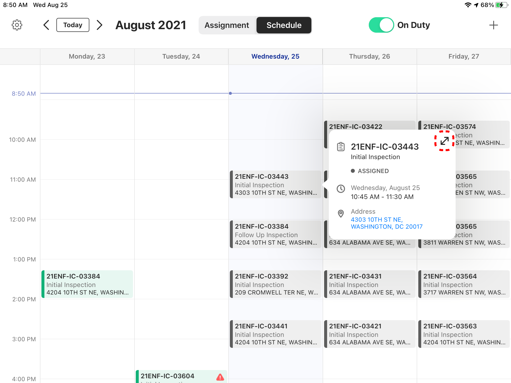
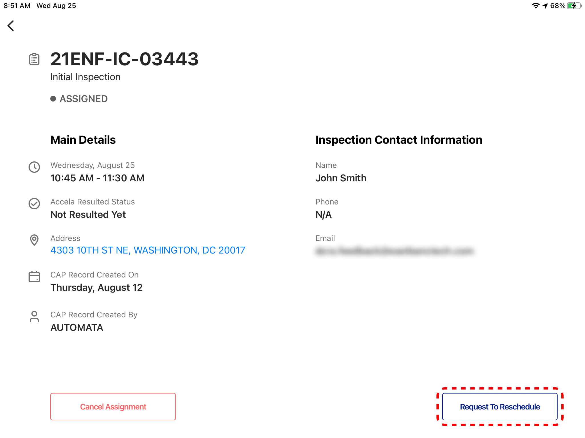
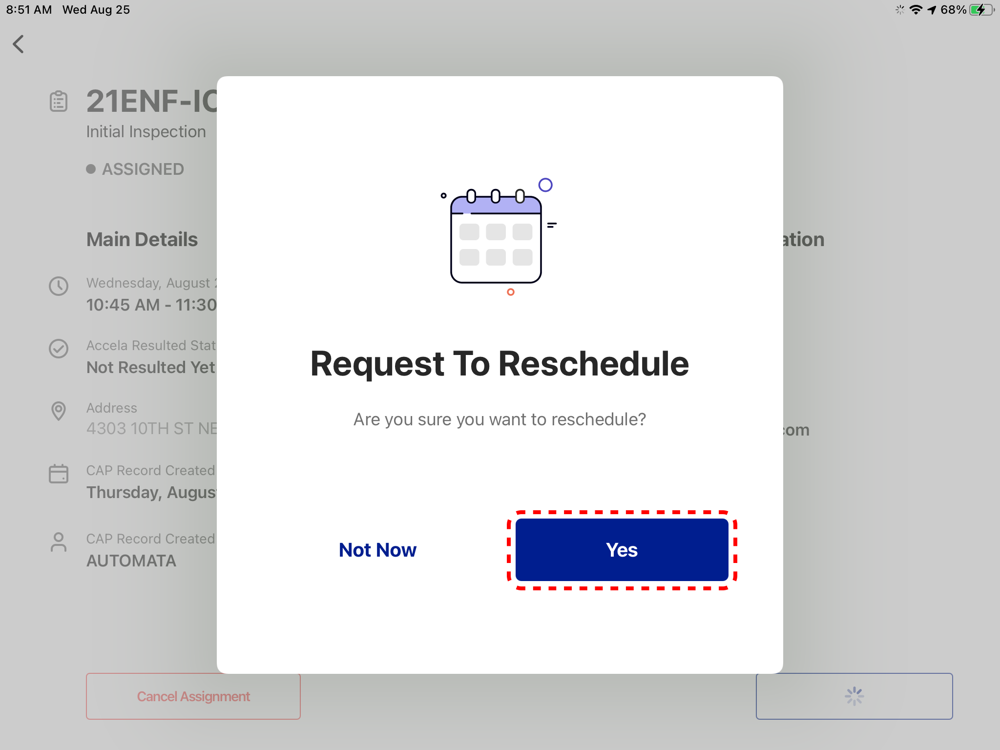
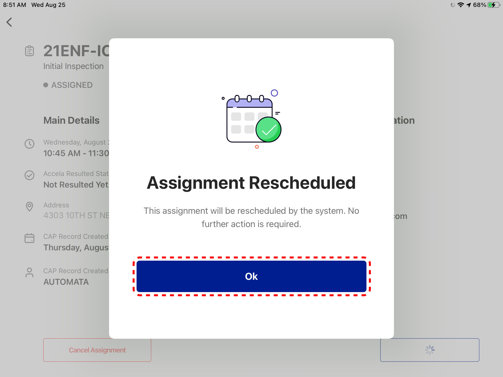

<section id="rescheduling-assignments" markdown="1">

# Rescheduling Assignments

Users can reschedule assignments directly from the Dispatch App.

<section id="rescheduling-current-assignment" markdown="1">

## Rescheduling Current Assignment
Click on Assignment Tab above the Schedule

Click on Request to Reschedule button

Select Yes on the popup message

Click Ok to dismiss the popup message

The App will display the next Assignment (if any) on the page

If there's no Assignment on the Schedule, the App displays the following

</section>

<section id="rescheduling-other-assignments" markdown="1">

## Rescheduling Other Assignments
Go to the Schedule and click on the Assignment you want to Reschedule, then click on the Enlarge Icon

On the Detailed Assignment page, click Request to Reschedule button

Select Yes on the popup message

Now the Assignment is Rescheduled. Select the Ok button to dismiss the popup message

The App will display the next Assignment (if any), and if there's no assignment it will display No Assignment message

</section>
</section>
