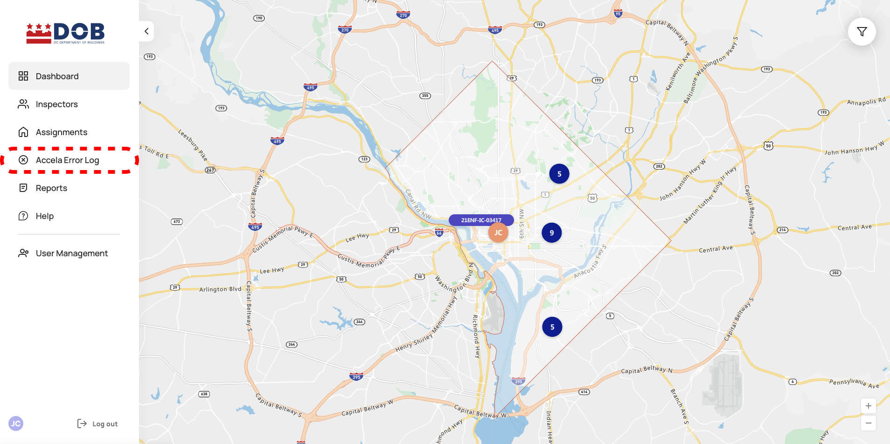
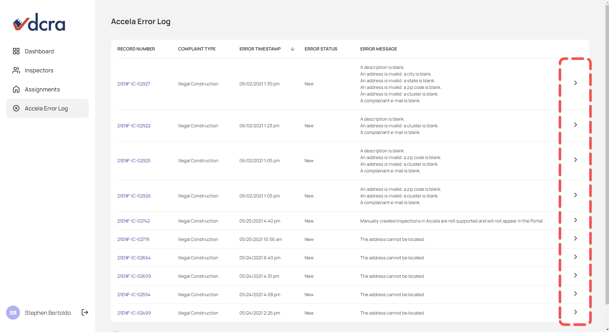
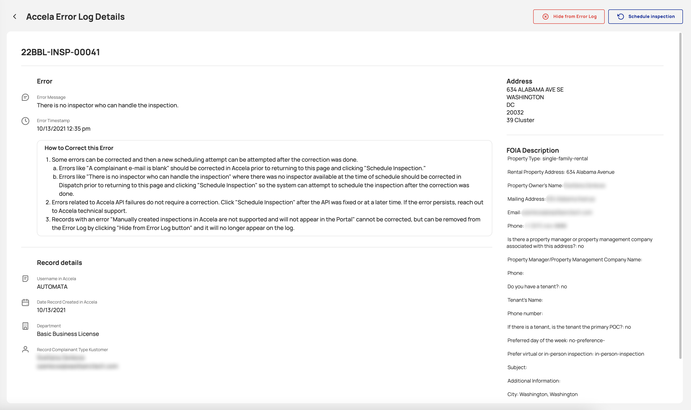
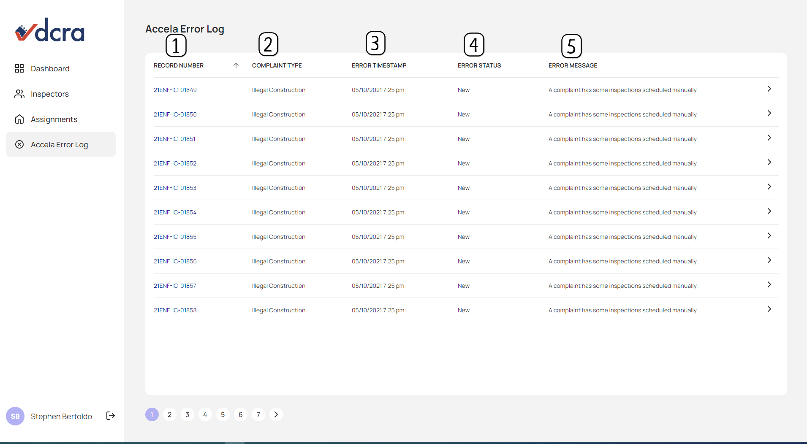

<section id="viewing-accela-error-log-page" markdown="1">

# Viewing Accela Error Log Page

The Dispatch Portal allows users to review assignment errors that occur between Accela and the Dispatch Portal.  

* The system requires certain criteria to be met in order to create assignments for Inspectors.  If the assignment criteria is not met an error will be added to the log for review. When an error occurs the system is not able to auto-schedule an assignment. 

<section id="navigate-to-accela-error-log" markdown="1">

## Navigate to Accela Error Log
Click on Accela Error Log from the side navigation panel.

{: data-lightbox="1"}

</section>
<section id="detailed-accela-error-log-page" markdown="1">

## Detailed Accela Error Log Page

Selecting the arrow/chevron button directs the user to a more detailed page regarding the seleted error. 
{: data-lightbox="2-group"}

{: data-lightbox="2-group"}

**Fields**

* **Error Message** - Displays the error that was encountered when attempting to schedule an assignment. 
* **Error Time Stamp** - Displays the system time when the error occured with the Dispatch application.
* **How to Correct this Error** - Displays a brief description on how users may resolve the issue either through being hidden from the log for errors that cannot be fixed or attempting to schedule the assignment once the error has been fixed.
* **Username in Accela** -  Displays the username of the user who created the case in Accela. 
* **Date Record Created in Accela** - Displays the date the case was created in Accela.
* **Department** -  Displays the department for the case. 
* **Record Complaint Type Kustomer** - Displays the user information for the submitting user from Kustomer.
* **Address** - Displays the address provided for the case. 
* **FOIA Description** - Displays all information provided for the case. 

**Actions**
* **Hide from Error Log** - Removes the error from the log. 
* **Schedule Inspection** - Triggers the system to reattempt scheduling the case. 

</section>
<section id="column-description" markdown="1">

## Column Description

{: data-lightbox="3"}

1. **Record Number Column** - Record/CAP number listed
2. **Complaint Type Column** - Record's Department
3. **Error TimeStamp Column** - Date/Time the record rejected
4. **Error Status** - Record's status
5. **Error Message Column** - Reason why the record was rejected

</section>
</section>
