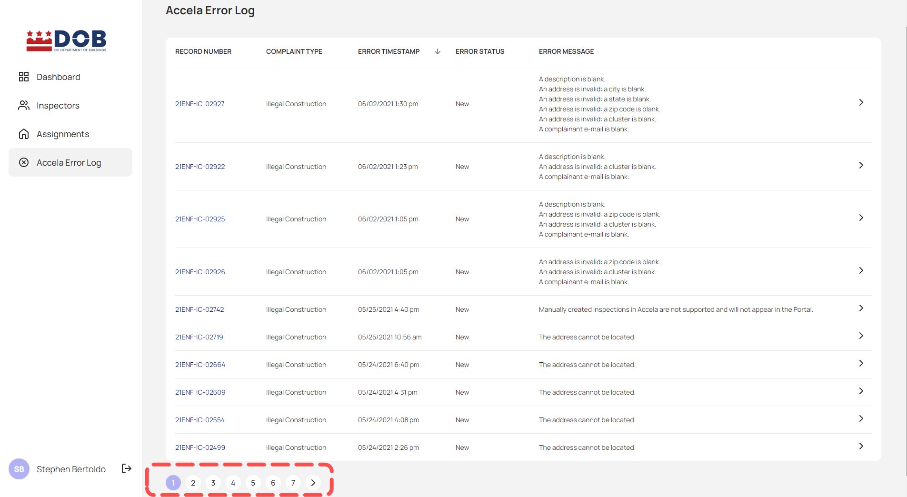
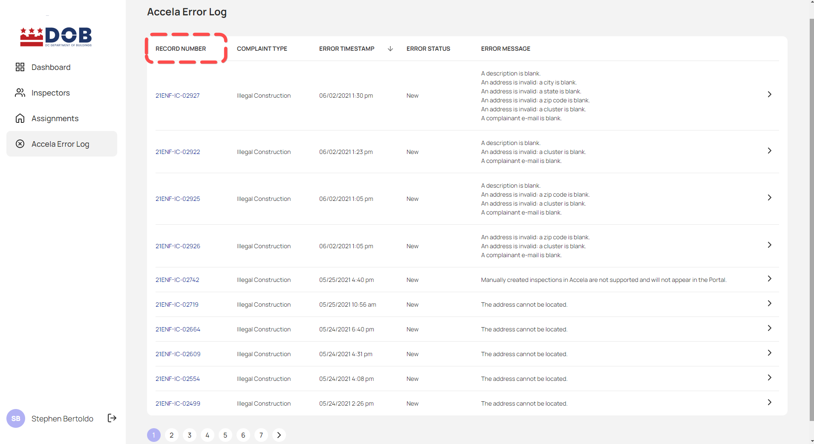
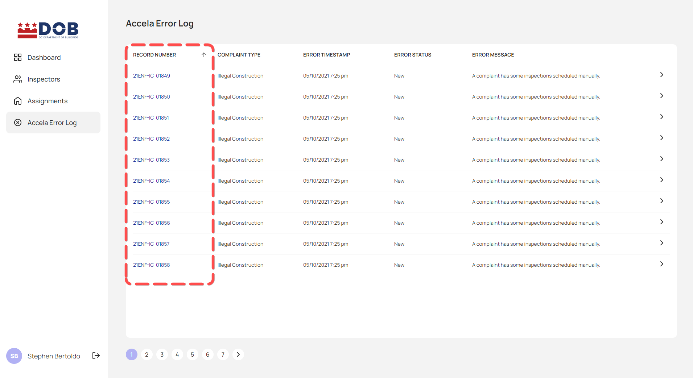
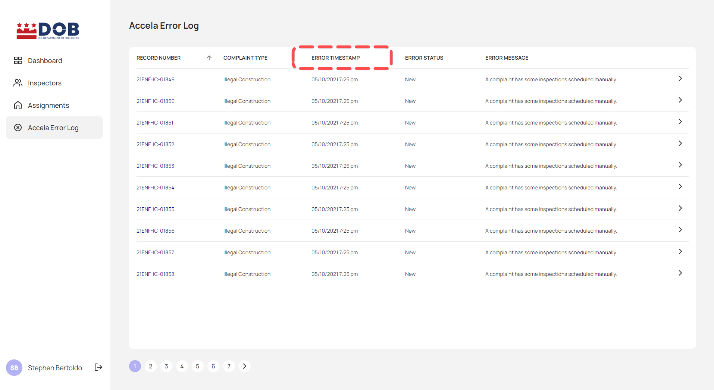
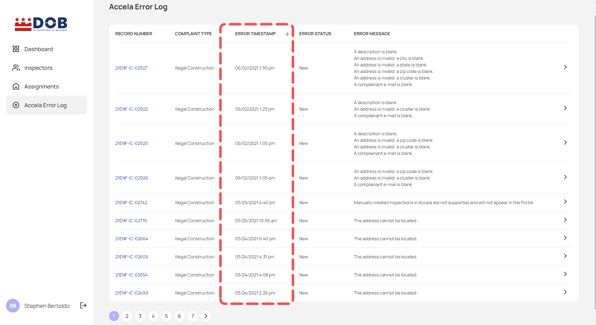

<section id="viewing-accela-error-log-page" markdown="1">

# Viewing Accela Error Log Page

Users can use the Dispatch Portal to view the Accela Error Log.

<section id="navigate-to-accela-error-log" markdown="1">

## Navigate to Accela Error Log
To navigate to the Accela Error log page, click on Accela Error Log from the side navigation panel.

 The user will be directed to the Accela Error Log page as seen below. The table is full of inspection submitted in Accela which doesn't meet parameters for auto-scheduling.
 

</section>

<section id="column-description" markdown="1">

## Column Description

1. Record Number Column: Record/CAP number listed
2. Complaint Type Column: Record's Department
3. Error TimeStamp Column: Date/Time the record rejected
4. Error Status: Record's status
5. Error Message Column: Reason why the record was rejected

</section>

<section id="detailed-accela-error-log-page" markdown="1">

## Detailed Accela Error Log Page

Clicking on the arrow icon on the list, the user will be directed to the Accela Error Log Details page as seen on the second screenshot.

</section>

<section id="sorting" markdown="1">

## Sorting

Users could navigate to different Accela Error Log pages by selecting the page numbers.

The table of Accela Error Log is sortable by each column by clicking on each specific column to either sort it oldest to the newest or newest to the oldest. For example, to sort the table by Record's number, click the Record Column, as seen below.

... or by Date/Time and so forth for each column.

</section>
</section>

