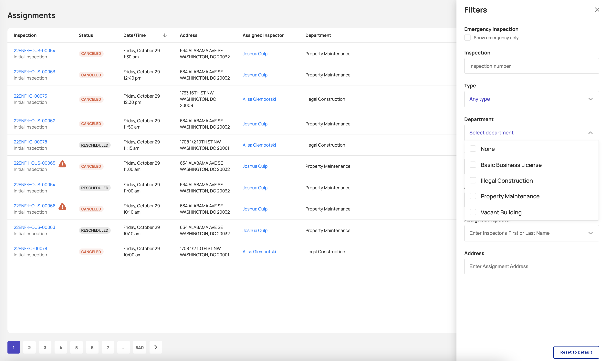

<section id="viewing-assignments-page" markdown="1">

# Viewing Assignments Page

The Assingments page allows users to view all assigments within the Dispatch system and what the current state of those assignments are, who they are assigned to, and when the assignment is to be completed or scheduled for a follow-up assignment (inspection).

Each user's view of the Assignments page will be defaulted to their perspective departments. The defualts can be changed via the filters to view details about other departments assignments. 

<section id="navigate-to-assignment-list" markdown="1">

## Navigate to Assignment List

Selecting Assignments navigates the user to the Assignments page.

* The Assignments page includes a table of all assignments. 

{: data-lightbox="1-group"}

{: data-lightbox="1-group"}

</section>

<section id="column-descriptions" markdown="1">

## Column Descriptions

{: data-lightbox="2-group"}
{: data-lightbox="2-group"}

1. **Inspection** - Inspection's ID linking to the details page for the inspection. If the inspection is an emergency it will be designated by a red indicator. 
2. **Status** - Inspection's status
3. **Date/Time** - Insepction's creation Date/Time
4. **Address** - Inspection's location/address
5. **Assigned Inspector** - Assigned Inspector's first name and last name
6. **Department** - Inspection's Department

</section>

<section id="actions-from-columns" markdown="1">

## Actions from Columns

<section id="assignment-location" markdown="1">

### Assignment Location
Selecting the location pin button navigates the user to the Dashboard and focuses the map to the exact location of the select assignment. 

{: data-lightbox="3"}

</section>

<section id="detailed-assignment-page" markdown="1">

### Detailed Assignment Page
Selecting the arrow/chevron button navigates the user to a detailed page outlining information about the assignment. 

{: data-lightbox="4"}

</section>
</section>

<section id="sorting" markdown="1">

## Sorting
The Assignments page allows users to navigate through assignments via table pagination and sort via column functionlity. 

<section id="pagination" markdown="1">

### Pagination

{: data-lightbox="5"}

<section id="column-sorting" markdown="1">

### Column Sorting

{: data-lightbox="6"}

</section>
</section>

<section id="filter" markdown="1">

## Filter 
Selecting the Filters button allows the user to define the assignments displayed by Inspection Number, Type, Department, Status, Date, Assigned Inspector, Address.

{: data-lightbox="7-group"}
{: data-lightbox="7-group"}
{: data-lightbox="7-group"}

1. The emergency filter will allow the user to display only emergency assignments.
2. Filtering using specific Inspection Number
3. Selecting All, Initial and Follow Up displays the selected Type of Assignment.
4. Filter Inspections by a specific department.
5. Filter Inspections by a specific status.
6. Filtering Inspection by a specific Assignment Date.
7. Filtering Inspections by the Assigned Inspector.
8. Filtering Inspections by address a specific DC address.

</section>
</section>

