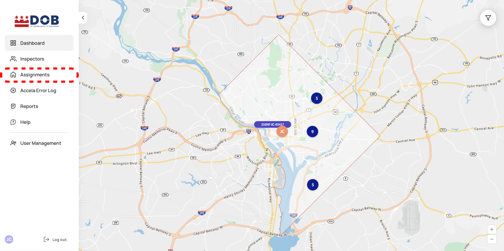

<section id="Viewing-assignments-page" markdown="1">

# Viewing Assignments Page

<section id="navigate-to-assignment-list" markdown="1">

## Navigate to Assignment List

1. Selecting Assignments navigates the user to the Assignments page.

* The Assignments page includes a table of all assignments. 

</section>

<section id="column-descriptions" markdown="1">

## Column Descriptions

    1. Inspection Column: Inspection's number listed this will be followed by an emergency indication if the assignment is an emergency as shown above
    2. Status Column: Inspection's status
    3. Date/Time Column: Insepction's creation Date/Time
    4. Address Column: Inspection's location/address
    5. Assigned Inspector Column: Assigned Inspector's first name and last name
    6. Department Column: Inspection's Department

</section>

<section id="actions-from-columns" markdown="1">

## Actions from Columns

<section id="map" markdown="1">

### Assignment Location
2. Selecting the location pin button navigates the user to the Dashboard and focuses the map to the exact location of the select assignment. 

</section>

<section id="detailed-assignment-page" markdown="1">

### Detailed Assignment Page
3. Selecting the arrow/chevron button navigates the user to a detailed page outlining information about the assignment. 

</section>
</section>

<section id="sorting" markdown="1">

## Sorting
4. The Assignments page allows users to navigate through assignments via table pagination and sort via column functionlity. 

### Pagination

### Column Sorting

</section>

<section id="filter" markdown="1">

## Filter
5. Selecting the Filters button allows the user to define the assignment displayed by Inspection Number, Type, Department, Status, Date, Assigned Inspector, Address.

    1. The emergency filter will allow the user to display only emergency assignments.
    2. Filtering using specific Inspection Number, click on Enter number and type in the Inpsection Number, then by pressing enter displays the selected Inspection on the list.
    3. Selecting All, Initial and Follow Up displays the selected Type of Inspection/Assignment.
    4. Filtering Inspections by department, click on Select department and selecting Illegal Construction and/or OIS displays Inspections of the selected department on the list.
    5. Selecting one, all or more of Assignment status filters, displays the selected Assignments with those statuses on the list. The Assignment status is driven by the actions of    the Inspector in the Inspector app or CityGov app, or an authorized Inspections Portal or Accela user. 
      * Assigned - the Inspection has an assigned time/date and Inspector
      * Inspector in Transit - Inspector is in transit to the Assignment/Inspection location
      * Inspection in Progress - Inspector is in the middle of conducting an inspection
      * Completed - Inspector resulted the Inspection in CityGov app
      * Rescheduled - The system processed the request and this Assignment has been rescheduled and a new Assignment with status Assigned has been created
      * Reschedule Requested - Inspector or Portal user requested a reschedule of the Assignment
      * Canceled - Inspector or Portal/Accela user canceled the scheduled Assignment/Inspection
    6. Filtering Inspection by Assignment Date, click on the Select assignments date range and selecting the range from the calendar displays Inspections within the selected date      range on the list
    7. Filtering Inspections by the Assigned Inspector, click on Enter Inspector's First or Last Name and begin typing in the Inspector's name (first or last), and select one of the    auto-complete matches from the list.
    8. Filtering Inspections by address, click on Enter Assignment Address and type the inspection address, then by pressing enter displays assignment/s with the selected address on    the list.
</section>
</section>

