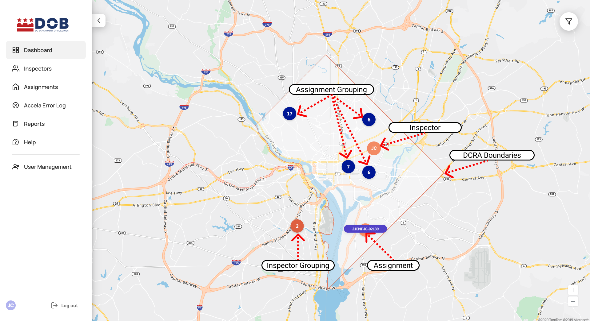
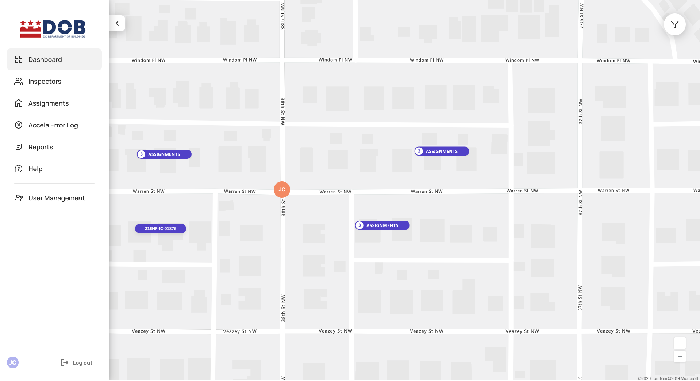

<section id="dashboard" markdown="1">

# Dashboard

<section id="map" markdown="1">

## Map
Upon login, the Dashboard is displayed with the Inspectors' and Assignments' real-time location.

<section id="dcra-boundaries" markdown="1">

### DCRA Boundaries
The map displays the DCRA boundaries via a red outline.

</section>

<section id="inspector-and-assignment-grouping" markdown="1">

### Inspector and Assignment Grouping
When two or more assignments or inspectors are grouped together the system will combine each into a single icon with the number of assignments or inspectors for that area.  Zooming in exposes additonal details about each group type.  

</section>
</section>

<section id="assignment-card" markdown="1">

## Assignment Card
Clicking on an Inspection number on the map displays a popup called the Assignment card with the following information: Inspection Number, Inspection date/time, Inspection Type, Inspection Address and Inspector Assigned.

Clicking through on the Inspection number on the card navigates to Assignment Details page.

Clicking on Assignment groupings on the map displays a list of Inspection Numbers with their status and clicking on an Inspection number from the list displays Assignment card popup.

</section>

<section id="inspector-card" markdown="1">

## Inspector Card
Clicking on the Inspector icon on the map displays the Inspector card with the following information: Inspector Name, Inspector Status, Schedule and Details.

Clicking the Icon, Inspector Name, or Details button on the card navigates to Inspector Details page.

</section>

<section id="filters" markdown="1">

## Filters
To filter out specific Assignments or Inspectors, click on the filter icon.

<section id="inspectors-filter" markdown="1">

### Inspectors Filter
Clicking on the filter icon displays the filters menu with RESET TAB and RESET ALL buttons.
   * RESET TAB button: Clicking Reset TAB button will resets all fields to default in the current filter menu
   * RESET ALL button: Clicking Reset All button will resets all fields to default in all three filters menu (Inspectors, Assignments and Clusters) 

1. Filter displayed Inspectors by a specific name
2. Filter displayed Inspectors by specific Departments
3. Filter displayed Inspectors by specific Types
4. Filter displayed Inspectors by specific Statuses

</section>

<section id="assignments-filter" markdown="1">

### Assignments Filter
Selecting Assignments from the filter menu bar displays the assignment filter.

1. Filter displayed Assignments by Emergency
2. Filter displayed Assignments by specific Inspection Number
3. Filter displayed Assignments by specific Type or all Types
4. Filter displayed Assignments by specific Departments
5. Filter displayed Assignments by specific Assignment Status or all Assignment Statuses

   * Assigned - the Inspection has an assigned time/date and Inspector
   * Inspector in Transit - Inspector is in transit to the Assignment/Inspection location
   * Inspection in Progress - Inspector is in the middle of conducting an inspection
   * Completed - Inspector resulted the Inspection in CityGov app
   * Rescheduled - The system processed the request and this Assignment has been rescheduled and a new Assignment with status Assigned has been created
   * Reschedule Requested - Inspector or Portal user requested a reschedule of the Assignment
   * Canceled - Inspector or Portal/Accela user canceled the scheduled Assignment/Inspection

6. Filter displayed Assignments by specific Assigned Inspectors
7. Filter displayed Assignments by specific Addresses
</section>

<section id="clusters-filter" markdown="1">

### Clusters Filter
Selecting Clusters from the filter will display the Clusters filter.

Selecting a single, multiple, or All from the filter  displays Inspections for the selected cluster(s).

</section>
</section>
</section>

