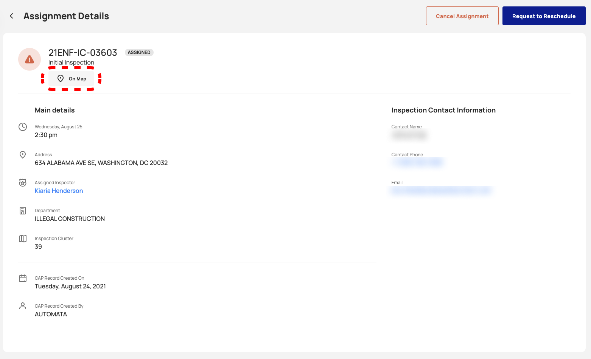

<section id="detailed-assignment-page" markdown="1">

# Detailed Assignment Page

User's can view detailed information about individual assignments through the Dispatch Portal.

<section id="field-descriptions" markdown="1">

## Field Descriptions

Clicking on the arrow icon will allow the user to navigate to the Assignment Details page

Assignment Details page will display the following information: Inspection Number, Inspection Status, Inspection Type, Inspection Date/Time, Inspection Address, Inspector Name, Department, Inspction cluster, Created On, Created By, Inspection Contact Name, Email and Cancel Assignment and Request Reschedule Assignment buttons

</section>

<section id="actions" markdown="1">

## Actions

<section id="on-map" markdown="1">

### On Map
Clicking ON Map will allow users to locate the assignment on the map

</section>

<section id="request-to-reschedule" markdown="1">

### Request to Reschedule
Clicking on Request to Reschedule button and confirming the action on the popup messages will allow the user to reschedule an assignment

Emergency assignments can be reassigned to specific users

</section>

<section id="cancel-assignment" markdown="1">

### Cancel an Assignment
Clicking on Cancel Assignment button and confirming the action on the popup messages will allow the user to cancel an assignment

</section>

<section id="emergency-assignments" markdown="1">

### Emergency Assignments
Emergency Assignments are disignated by a red [!] icon.

**Assignments Table**

**Assignment Details**

### Completed Assignments
When an assignment is completed additional details are added to the Assignment details page and users are no longer allowed to cancel or reschedule the assignments. 

Completed assignments display the result of the inspection. The results are displayed under the column labled Accela Data and the field label Accela Resulted Status.

</section>
</section>
</section>
