<section id="detailed-assignment-page-updated" markdown="1">

# Detailed Assignment Page 

User's can view detailed information about individual assignments through the Dispatch Portal.
<section id="field-descriptions" markdown="1">

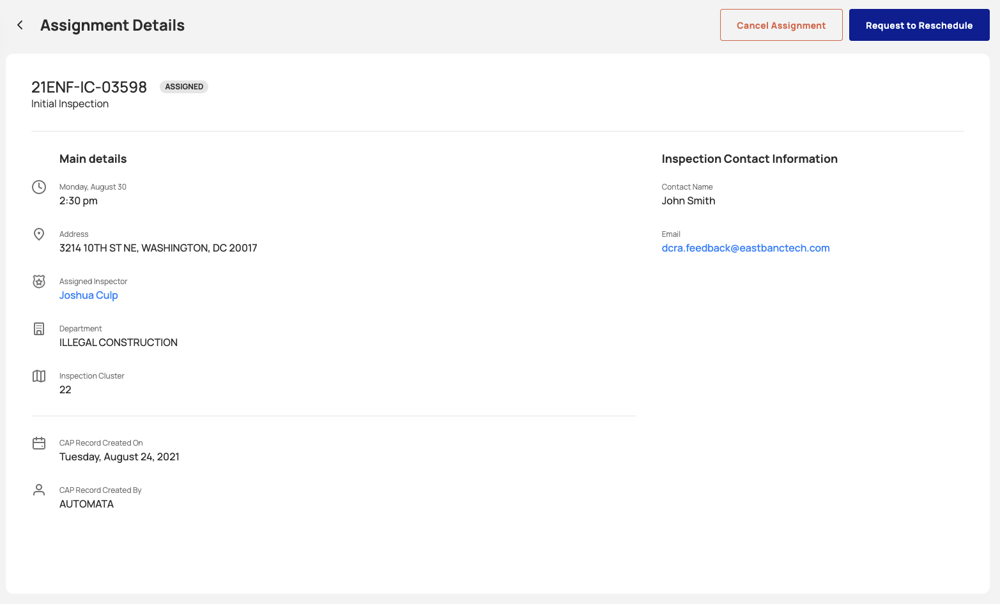{: data-lightbox="2"}

Assignment Details page will display the following information: 
* **Inspection** - Displays the inspection id.
* **Inspection Status** - Displays the inspections current status.
* **Inspection Type** - Displays the type of inspection.
* **Inspection Date/Time** - Displays the time and date the inspection will be completed.
* **Inspection Address** - Displays the address where the inspection will take place. 
* **Inspector Name** - Displays the assigned inspector. The inspector will be a link directing the user to the details page for the selected inspector. 
* **Department** - Displays the department the inspection has been created for. 
* **Inspction cluster** - Displays the cluster the inspection is located in. 
* **CAP Record Created On** - Displays the date the inspection was created. 
* **CAP Record Created By** - Displays the user or system that created the inspection. 
* **Inspection Contact Name** - Displays the name of the customer who requested the inspection. 
* **Email** - Displays the email of the customer who requested the inspeciton. 

## Completed Assignment Details
When an assignment is completed (resulted in DOB Mobile Inspection App or Accela), additional details are added to the Assignment details page. Users can no longer cancel or reschedule the assignment. 

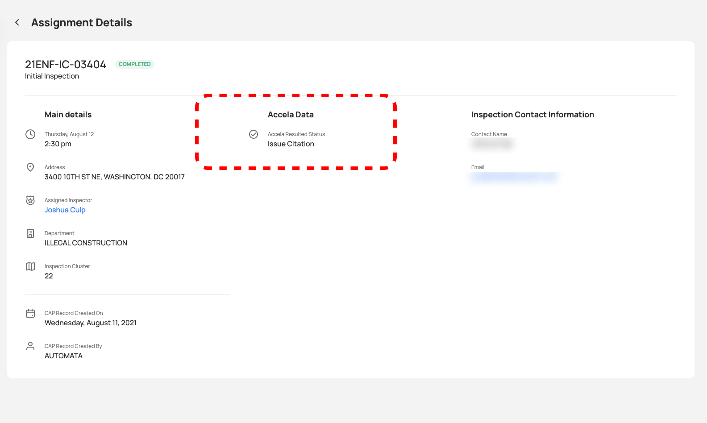{: data-lightbox="9"}
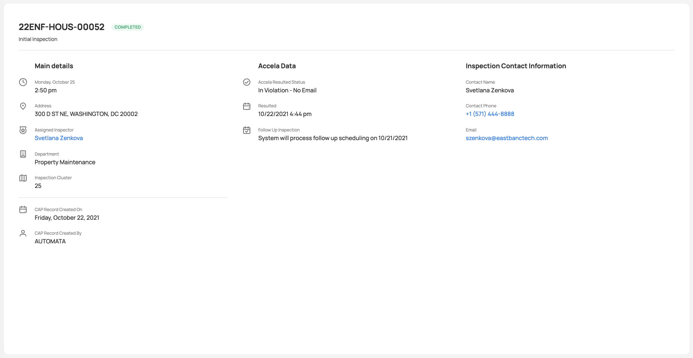{: data-lightbox="10"}

* **Accela Resulted Status** - Displays the status applied to the inspection through CityGov.
* **Resulted** - Displays the Date and Time the inspection was resulted.
* **Follow Up Inspection** - If a follow up inspection is required due to the Accela Resulted Status the system will display the date and time of the next inpection, when the system will attempt to schedule a follow up inspection, or the Inspection ID linking to the details for the follow up inspetion. 

## Assignment Actions
The following actions are permitted via the detailed assignments page. 

* **Request to Reschedule** - Reschedules the assignment to the next available inspector. See Request to Rescedule below for more detials. 
* **Cancel Assignment** - Cancels the selected assignment and removes the assignment from the inspectors schedule. See Caceling an Assignment below for more detials. 
* **On Map** - Clicking On Map will allow users to locate the assignment on the map. Only avialable for assignments that are scheduled for today.

### Request to Reschedule
Clicking on Request to Reschedule button and confirming the action on the popup messages will allow the user to reschedule an assignment.

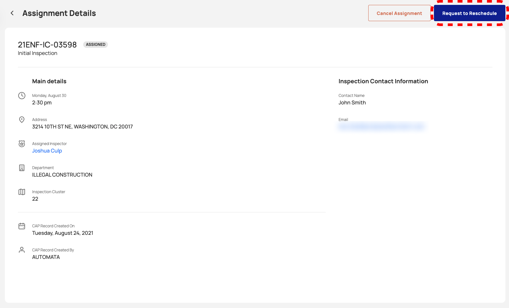{: data-lightbox="4"}

Emergency assignments can be reassigned to specific users.

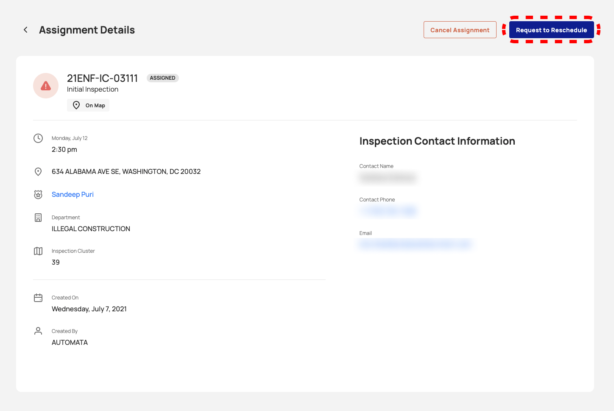{: data-lightbox="5-group"}

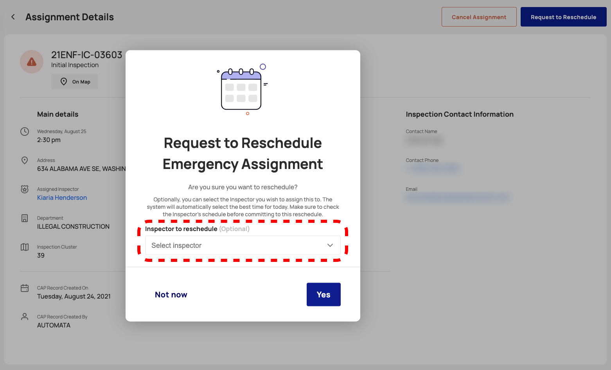{: data-lightbox="5-group"}

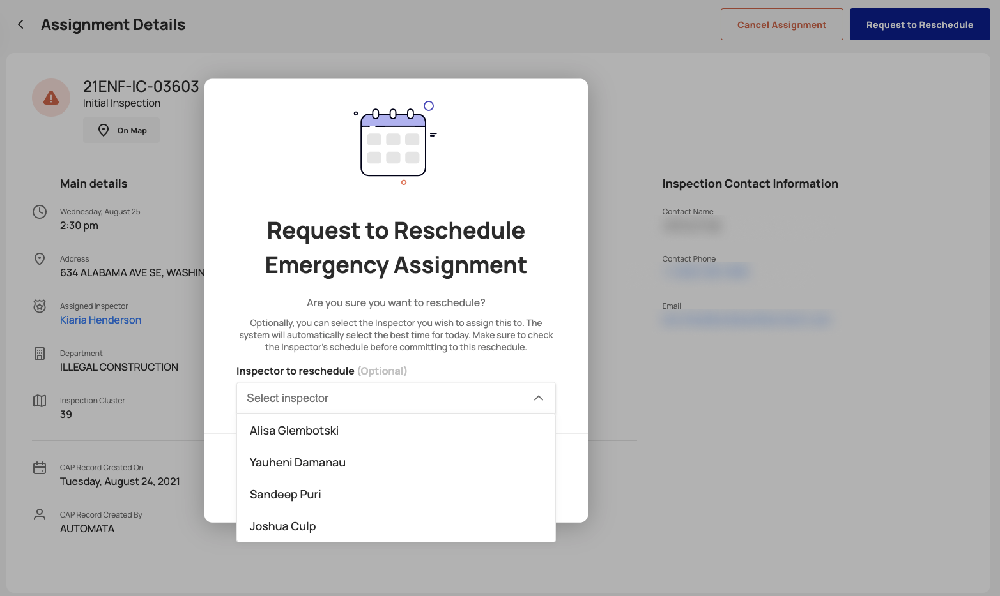{: data-lightbox="5-group"}

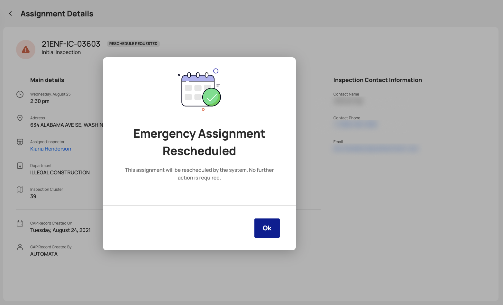{: data-lightbox="5-group"}
</section>

<section id="cancel-an-assignment" markdown="1">

### Cancel an Assignment
Clicking on Cancel Assignment button and confirming the action on the popup messages will allow the user to cancel an assignment.

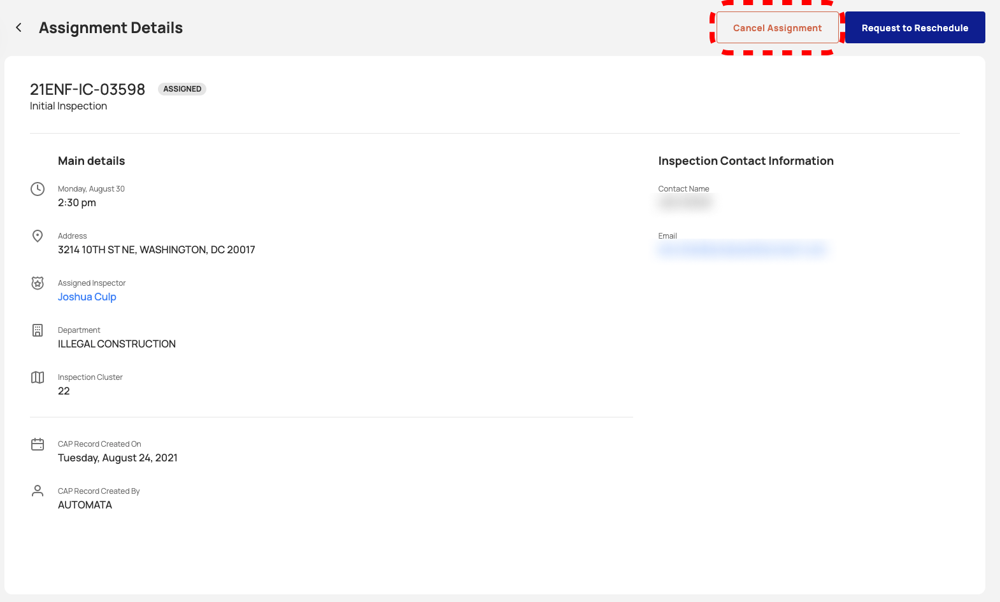{: data-lightbox="6-group"}

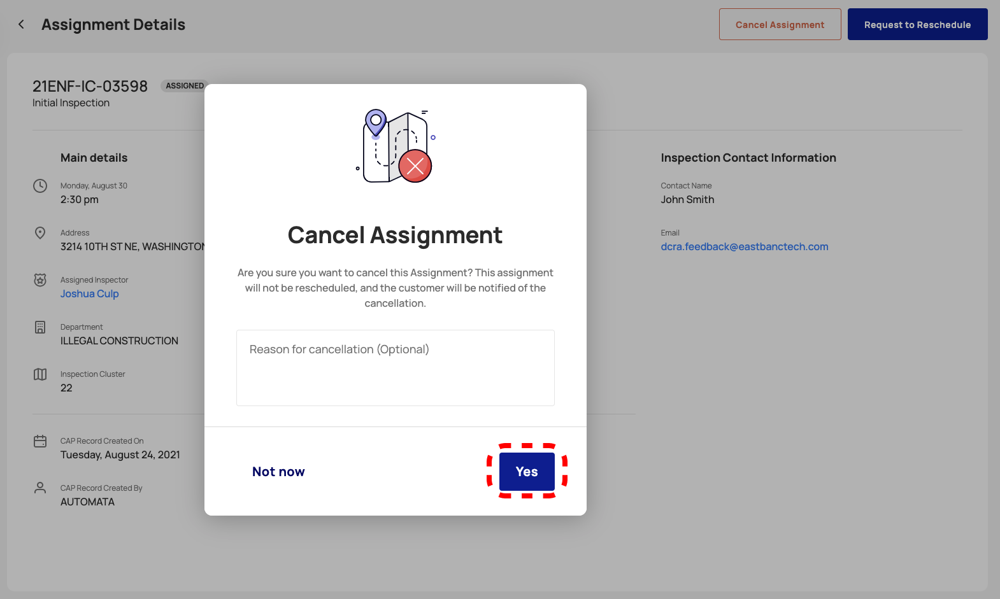{: data-lightbox="6-group"}

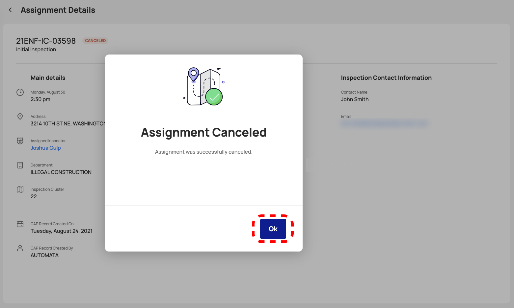{: data-lightbox="6-group"}

</section>

<section id="emergency-assignments" markdown="1">

### Emergency Assignments
Emergency Assignments are disignated by a red [!] icon.

**Assignments Table**

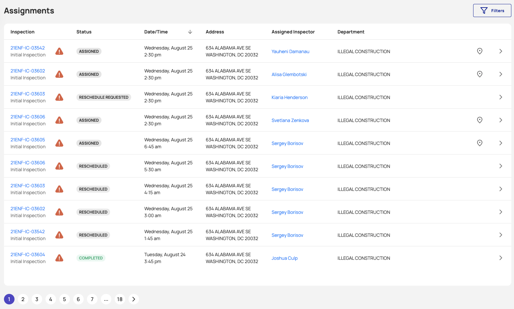{: data-lightbox="7"}

**Assignment Details**

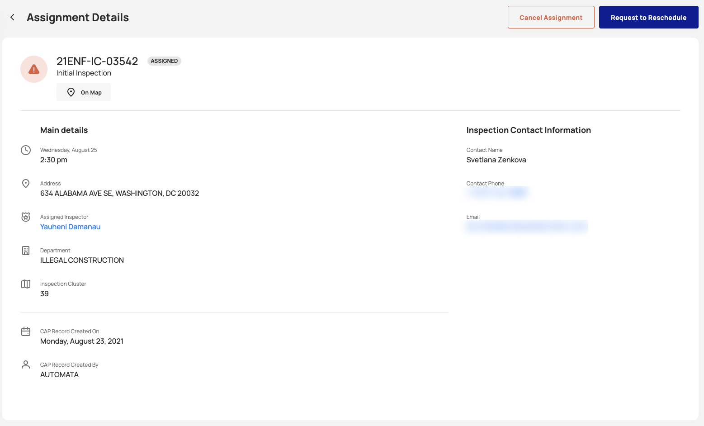{: data-lightbox="8"}

<section id="completed-assignments-new" markdown="1">

</section>
</section>
</section>
