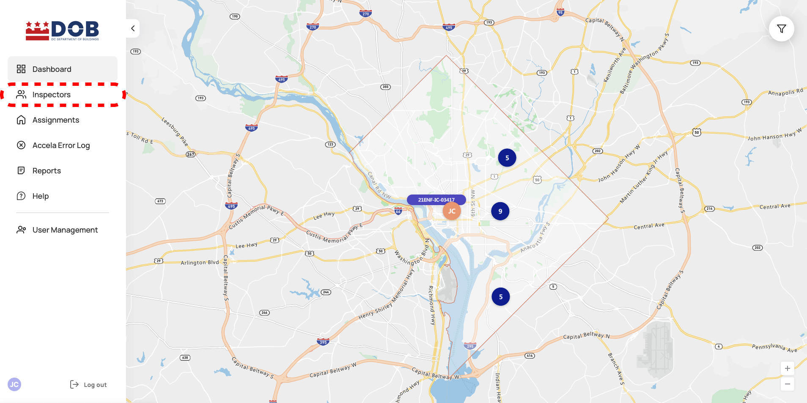

<section id="viewing-inspectors-page" markdown="1">

# Viewing Inspectors Page

<section id="navigate-to-inspectors-list" markdown="1">

## Navigate to Inspectors List

To navigate to the full Inspectos list, click on Inspectors from the side navigation panel.

{: data-lightbox="1"}

The user will be directed to the Inspectors page as seen below. The table shows the full list of Inspectors registered with DCRA and permissioned appropriately.

{: data-lightbox="2"}
</section>

<section id="column-descriptions" markdown="1">

## Column Descriptions

{: data-lightbox="3"}

1. Name: Displays the inspector's first and last name along with information regarding the last time they were seen utilizing the Dispatch app.
2. Status: Displays the inspector's status.
3. Inspector Type: Displays the inspector's type.
4. Contact Information: Displays the inspector's email.
5. Department: Displays the inspector's department(s).
6. Clusters: Displays the inspector's assigned clusters.
</section>

<section id="sorting" markdown="1">

## Sorting

Users could navigate to different inspector pages by selecting the page numbers.

{: data-lightbox="4"}

The table of Inspectors is sortable by each column by clicking on each specific column to either sort it A-Z or Z-A. For example, to sort the table by Inspector's Last Name, click the Inspector column, as seen below.

{: data-lightbox="5"}

</section>

<section id="actions-from-columns" markdown="1">

## Actions from Columns

By clicking the location icon on the list, the users will be directed to the inspector's location on the map.

{: data-lightbox="6-group"}

{: data-lightbox="6-group"}

Clicking the arrows on the list, the users will be directed to the Inspector Details page.

{: data-lightbox="7-group"}

{: data-lightbox="7-group"}

Clicking the On Map button/location icon on the Inspector Details page the users would will be directed to the inspectors location on the map.

{: data-lightbox="8"}

</section>

<section id="filter" markdown="1">

## Filter 

Clicking the Filters button will display the Inspector filters menu, which allows the user to filter by Inspector Name, Type, Department and Status. Selecting specific filters will only display Inspectors that match the selected criteria. Clicking RESET TO DEFAULTS button will clear all selected filters.

{: data-lightbox="9-group"}

{: data-lightbox="9-group"}

{: data-lightbox="9-group"}

1. Filtering the list using Inspector's Name: click on Inspector name and begin typing in the Inspector's name (first/last), and select one of the auto-complete matches from the list.
2. Filter Inspectors by a specific Department(s).
3. Filter Inspectors by a specific Cluster(s).
4. Filter Inspectors by a specific Type(s).
5. Filter Inspectors by a specific Status(s).

</section>
</section>
