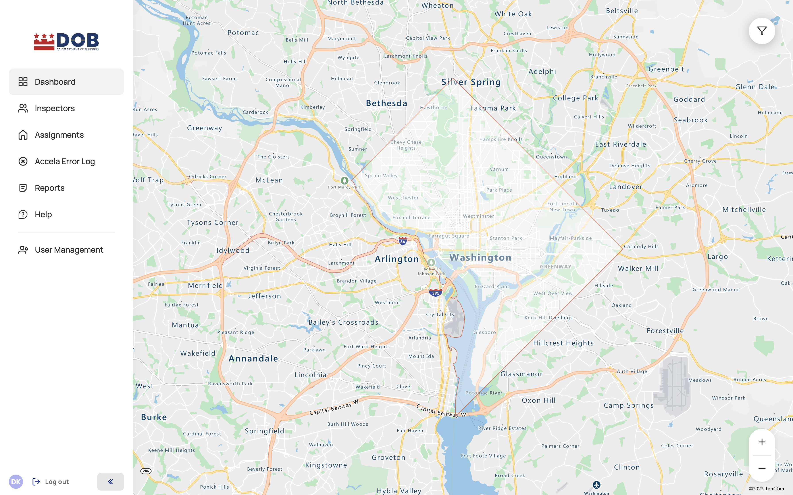

<section id="login-to-dispatch-portal" markdown="1">

# Login to Dispatch Portal
Navigate to [Dispatch Portal](https://tq-city-inspector-portal-staging.azurewebsites.net/login)

Click on SIGN IN button and enter your Access DC Username and Password

Once you're logged in, the system displays the dashboard with the map of Inspectors and Inspections/Assignments for TODAY.

</section>