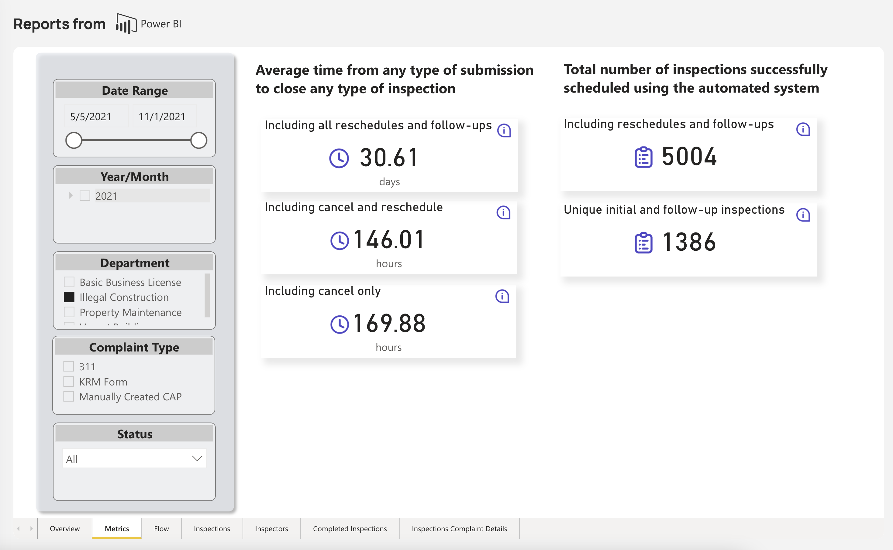
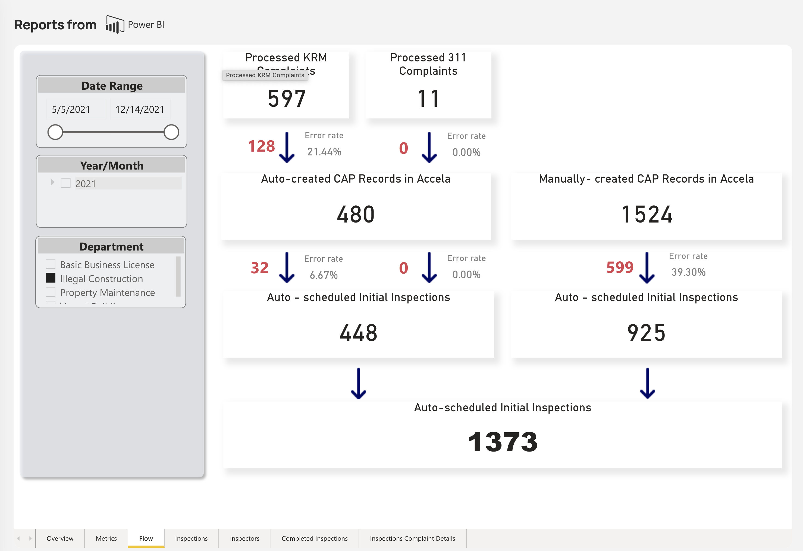
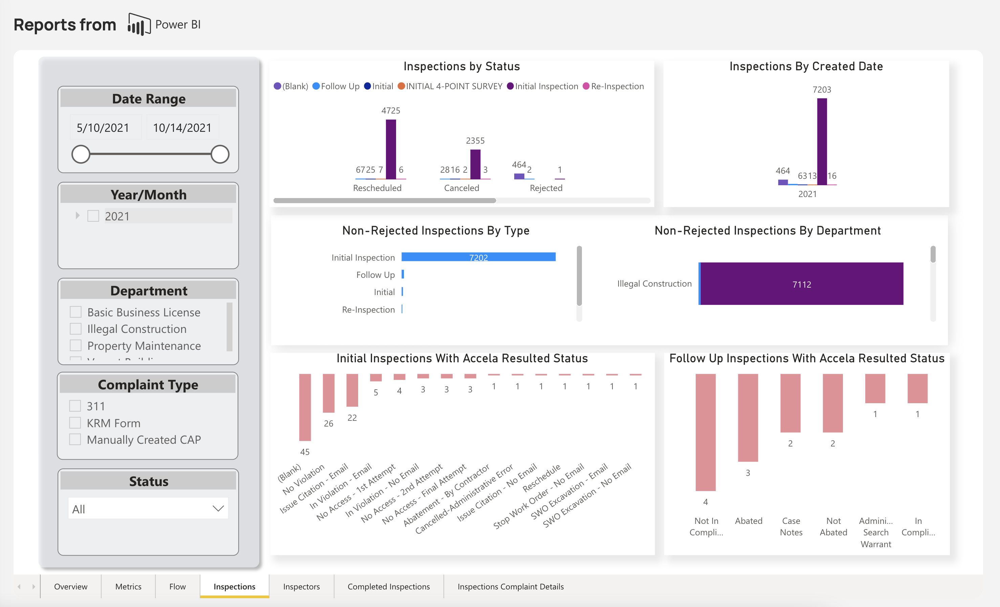
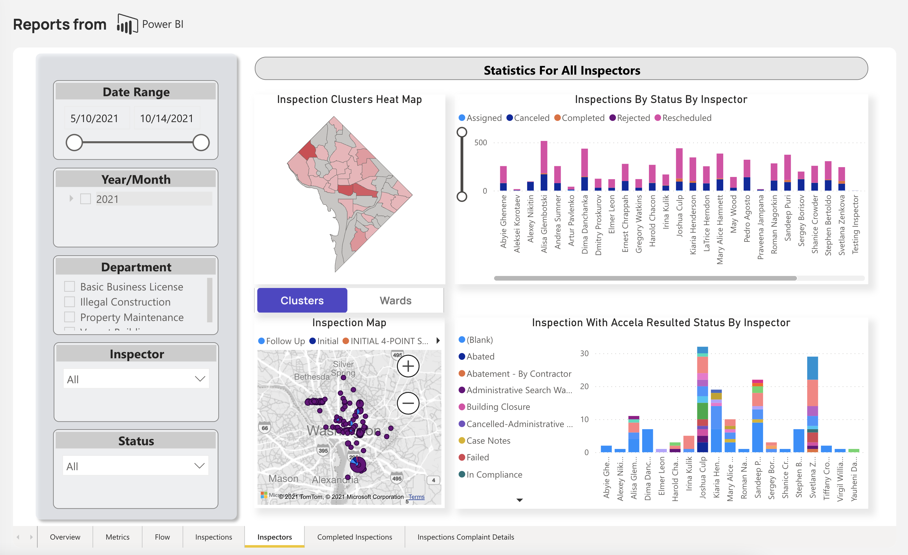
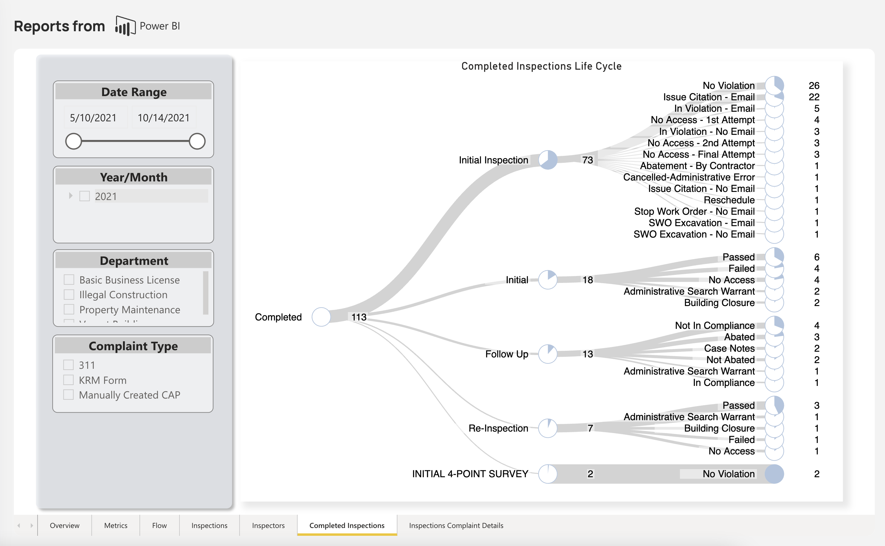
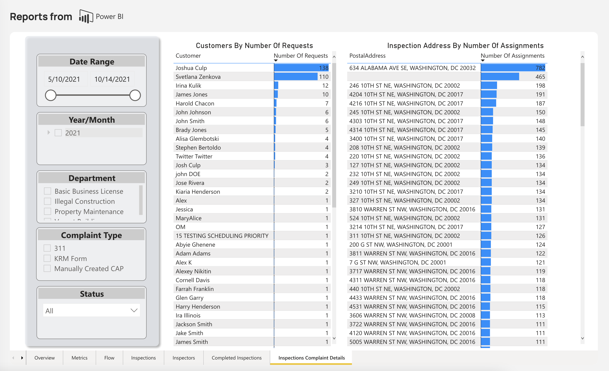

<section id="reports-page-new" markdown="1">

# Reports Page NEW
Reports aim to give historical and realtime metrics to understand the current health of each program within the Dispatch system.  Each tab gives the user different benchmarks to help look at the data in different ways. The Reports functionality is only avialable for users with the role of User Admin.

**Filters**
The filters below can applied per tab. Each tab can have different filters available for use.
* **Date Range** - The Date Range filter allows the user to specify an exact amount of time to review.
* **Year/Month** - The Year/Month filter allows the user to specify an exact year or month to review. 
* **Department** - The Department filter allows the user to review department specfic information. 
* **Complaint Type** - The Complaint Type filter allows the user to review data for specific complaint origins. 
* **Status** - The Status filter allows users to review data based on the status of an assignment.
* **Inspectors** - The Inspectors filter allows users to review data based on a specific inspector. 

## Overview Tab
The Overview tab outlines the highlest level view of the reports functionality, and serves as the landing page for at a glance inspection information. 

**Heat Map**
The heat map allows the user to see where the most assignments and least assignments are in DC. When a section is dark red (clusters) or blue (wards) the more assignments as the cluster gets less red/blue and more gray there are fewer assignments. The heat map can display the heat map data based on clusters or wards via the toggle below the map.

**Inspection Map**
The inspection map breaks down inspections across the map based on the type of inspection.  If there are multiple inspections of different types within the same address the inspection node will be displayed as a pie chart.  Each node/piechart can be hovered to display additional information about the inspection type. 

**Inspection Life Cycle**
The inspection life cylce shows the progression of each inspection from start to it's eventual outcome. The wider the line the more inspections in the path. 

{: data-lightbox="1-group"}

## Metrics Tab
The metrics tab allows users to review information about the amount of inspections, unique inspections, and averages for how long inspections are taking from creation to result. 

**Metrics Available**

**_Average time from any type of submission to close any type of inspection_**
* Including all rescheduled and follow-ups (Days)
* Including cancel and reschedule (hours)
* Including cancel only (hours)

**_Total number of inspections successfully schedule using the automated system_**
* Including reschedules and follow-ups
* Unique iniital and follow-up inspections

{: data-lightbox="1-group"}

## Flow Tab
The flow tab outlines the submissions that were made via KRM, 311, or manually. It tracks the submissions through CAP record creation in Accela and further whether the record was successfully scheduled through Dispatch. 

**Flow Points**
* **Processed KRM Complaints** - The number of records submitted through various KRM forms.
* **Processed 311 Complaints** - The number of records submitted through the 311 process.
  * **Error Rates** - Next to Processed KRM and 311 there is an arrow designating the flow of the record.  This is a point where we begin to show error rate for the submitted records in red. The percentage of that error rate is displayed above and below the flow arrows.
* **Auto-created CAP Records in Accela** - The number of records from Processed KRM and 311 that successfully created CAP records with Accela.
* **Manually-created Inspections in Accela** - CAP records not created via the KRM or 311 functionality.
  * **Error Rates** - Similar to Processed KRM and 311 the system tracks whether or not the CAP record creates an Inspection with the Dispatch system.  If a record is not created successfully it is considered an error. An arrow signifies the flow of the record. Next to each error the number of failing records is displayed in red with the percetage of the errors dispalyed above. 
* **Auto-scheduled Initial Inspections** Auto-created CAP Records in Accela displays the number of inspections created by the system throug KRM and 311. Manually-created CAP Records in Accela displays the number of inspections created through manual processes. Both do no include records that errored via any previous flow point. The number between Auto-created CAP Records in Accela and Manually-created CAP Records in Accela is the total number of successful inspections created through all processes. 

{: data-lightbox="1-group"}

## Inspections Tab
The inspections tab outlines information about inspections within the Dispatch app.

* **Inspections by Status** - Displays the resulting status of inspections compared against each inspection type.
* **Inspections By Created Date** - Displays the type of inspections created for a given time range. 
* **Non-Rejected Inspections By Type** - Displays the number of inspection for each inspection type. 
* **Non-Rejected Inspections By Department** - Displays the number of inspections created for each department according to inspection type. 
* **Initial Inspections With Accela Resulted Status** - Displays the number of initial inspections for each resulting status.
* **Follow Up Inspections With Accela Resulted Status** - Displays the number of follow-up inspections for each resulting status.

{: data-lightbox="1-group"}

## Inspectors Tab
The inspectors tab outline inspection information based on specific inspectors. 

Heat Map and Inspection Map are defined via the Dashboard section above.
* **Inspections By Status By Inspector** - Displays the number of inspections associated to an inspector by the status of the inspection. 
* **Inspections With Accela Resulted Status By Inspector** - Display the number of inspections associated to an inspector based on the resulting status of the inspections. 

{: data-lightbox="1-group"}

## Completed Inspections Tab
The completed inpsections tab is defined via the Inspections Life Cycle section of the Dashboard section above. 

{: data-lightbox="1-group"}

## Inspections Complaint Details
The inspections complaint details outlines information about the submitting customer and submitted address for complaints.

* **Customers By Number Of Requests** - Displays the number of complaints submitted by a paticular customer.
* **Inspection Address By Number of Assignemnts** - Displays the number of complains submitted for a specific address. 

{: data-lightbox="1-group"}

</section>
