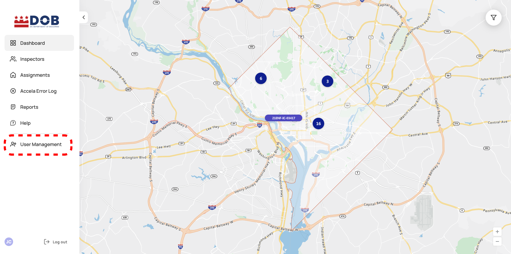

<section id="user-management-new" markdown="1">

# User Management NEW

Users who have been provisioned with [User Admin role](https://dcra-dispatch-docs.terraiq.io/docs/dp-user-management.html#user-roles) have access to the User Management functionality through in the Dispatch Portal. The User Management feature allows for updates to a user's role, which has an impact on level of access and other permissions described below. User Management is accessed via the main navigation menu (outlined in red below).  

{: data-lightbox="1"}

<section id="user-management-page-overview" markdown="1">

## User Management Page Overview

The User Management page contains a list of users within the Dispatch system, and acts as the hub to add users, search for users, and update user permissions.

{: data-lightbox="2"}

<section id="search-filter-and-sort" markdown="1">

### Search, Filter, and Sort

The User Management page features standard searching (by name or email), filtering (by user role, inspector type, department, cluster, or user status (Active/Inactive/Invited), and table sorting functionality.

Users can be found by searching via the search bar located in the top right corner of the table.  As users type their search the system features type ahead results and updates results as the search criteria is added. 

{: data-lightbox="3"}

Filtering allows the results to be defined by role, inspector type, department, cluster, or user status.

{: data-lightbox="4"}

The User Management table has standard table sorting by column. 

</section>
<section id="add-new-user" markdown="1">

### Add New User

User Admins have the ability to add users to the Dispatch system. Selecting Add New User triggers a modal window allowing the creation of a new Dispatch user. Once all required fields are satisfied, selecting Add User confirms the action. 

* Users must exist in Access DC and be assigned to the DCRA City Inspector application first.
    * If User is meant to be an Inspector of any kind, they also must have a profile in Accela set up with the same email address used in Access DC.
* Creating a new user triggers an invite email that is sent to the provided email address and adds the user to the User List with status "Invited."
* After the new user logs in for the first time the system will automatically move them to "Active."
* Invitations can be resent from the User Permissions Details Page only when the user has the "Invited" status.

{: data-lightbox="5"}

<section id="access-dc-account-email-address" markdown="1">

#### Access DC Account Email Address

An active Access DC email account is required to add a new user to Dispatch. The user undergoes specific provisions when added on Access DC side. The process is different for users with personal email addresses not affiliated with dc.gov and should reach out to DCRA management to resolve that.

If a user is to be set up as an Inspector (see roles below), the user must have a profile set up in Accela as well with the same email used for Access DC.

</section>
<section id="name" markdown="1">

#### Name

A Name is required in order to create a new account. 

</section>
<section id="user-roles" markdown="1">

#### User Roles

A user can have up to two different roles: 1. Inspector and 2. Only one of the following: User Admin OR Manager OR Portal user. 

1. **User Admin** - has access to all features and functionality on the Portal, the only user that has access to User Management functionality.
2. **Manager** - has access to all Portal pages including Reports and can edit Inspector Settings, but no access to User Management functionality.
3. **Portal User** - has access to all Portal pages, except Reports and User Management.
4. **Inspector** - has access to the Dispatch app only. Selecting Inspector will require additonal details (Inspector Type, Clusters, and Inspection Availability Hours).

</section>
<section id="department" markdown="1">

#### Department

Selecting a department designates the types of inspections Inspectors can get assigned. 

* Department is an optional field for users designated as Inspectors.
* Managers and Portal Users are not required to have a Department, but if one is selected, it would serve as a pre-selected filter for Portal pages.
    * Exception: Reports are embedded from Power BI and therefore don't have a dependency on the selected Department and it must be selected manually.
* If Inspector is categorized as a Duty Officer, then the Duty Officer should be assigned to all available Department they are expected to conduct an inspection in.

</section>
<section id="inspector-type" markdown="1">

#### Inspector Type

Inspector Type selection designates whether the inspector is Internal, Duty Officer, External. 

1. **Internal Inspectors** – DCRA Inspectors
2. **Duty Officers** – Managers who conduct inspections under special circumstances, such as emergencies that need to be done when no other inspector is available
3. **External Inspectors** - Inspectors that are Resident Inspectors or other 3rd party inspectors

</section>
<section id="clusters" markdown="1">

#### Clusters

The clusters field is an optional field. Once assgined to an Inspector, only inspections that belong to the same cluster can be assigned to the Inspector.

Currently, only PM inspectors are assigned to clusters

</section>
<section id="inspection-availability-hours" markdown="1">

#### Inspection Availability Hours

* Inspector's Hours should be added of when an Inspector is expected to conduct inspections. 
* Duty Officers can have 24 hour availability as they are not assigned regular inspections.
* External Inspectors can have 24 hour availability as well and use absences to modify their availability.
    * Currently External Inspectors even if provisioned in Dispatch will not receive any inspections.

Inspectors availability can be adjust by designating what days are available via the checkbox to the left of the day and the hours the user is available via the start and end timeframe dropdowns. To indicate the Inspector is off on specific days, a checkbox should be unselected and "No Availability" will be displayed. 

</section>
</section>
</section>
<section id="user-permission-details-page" markdown="1">

## User Permission Details Page

Selecting a user via the User Mangement table navigates to the User Permission Details page. From the User Permission Details page, updates can be made to the selected user by selecting the Edit User Permissions button. If the user has the Inspector role, the View Inspectors Settings button is available and navigates to the Inspector Details page, where User Admin or Manager can edit the user settings (see [Edit Inspector Settings](https://dcra-dispatch-docs.terraiq.io/docs/dp-user-management.html#edit-inspector-settings)

{: data-lightbox="6"}

<section id="edit-user-permissions" markdown="1">

### Edit User Permissions 

The Editing User Permissions modal allows for updates to the user's role, department, and user status. All udpates must be saved via the Save Changes button. 

{: data-lightbox="7"}

<section id="user-status" markdown="1">

#### User Status

User status designates whether a user has access to the Dispatch system. To disallow access, move the toggle to Inactive and the user will no longer be able to access the Dispatch Portal or the Dispatch app. 

</section>
</section>
</section>
<section id="view-inspector-settings" markdown="1">

## View Inspector Settings

Clicking on View Inspector Settings on User Permission Details page, navigates to Inspector's Details page, where a User Admin or Manager can make updates to an Inspector's settings by selecting the Edit Inspector Settings button.

{: data-lightbox="8"}

<section id="edit-inspector-settings" markdown="1">

### Edit Inspector Settings

Updates can be made to the Inspector's Type, Clusters, and Inspection Availability Hours.

{: data-lightbox="9"}

</section>
</section>
<section id="no-invitation-login" markdown="1">

## No Invitation Login

Users that try to log in without an invitation who haven't been provisioned in the Dispatch system yet will be added to the user list in an "Inactive" status and with no permissions.

* The user must reach out to a User Admin to set up Permissions and an Active status. 
* No invitation login users will not have a "Resend Invitation" link on the User Permissions Details page

</section>
</section>
