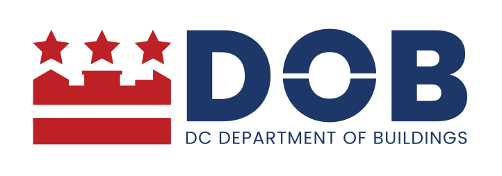

# DOB Dispatch User Guide

 

{: .big-size}{: .no-border}

The Department of Buildings is responsible for regulating construction activity in the District of Columbia. The agency operates a consolidated permit operations division, reviews all construction documents to ensure compliance with building codes and zoning regulations, and has inspection and oversight authority, through which construction activity, building systems, and rental housing establishments are inspected, with violations cited and, if necessary, abatement pursued within the limits of the law.
